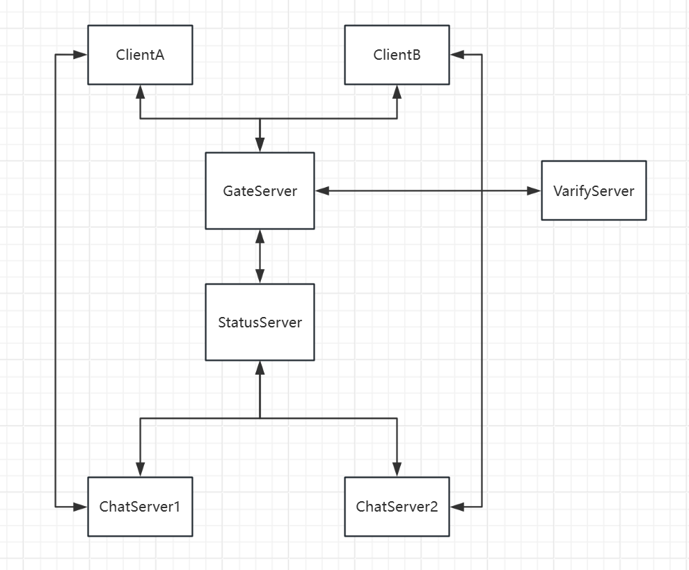
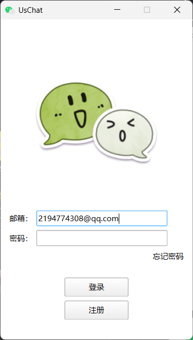
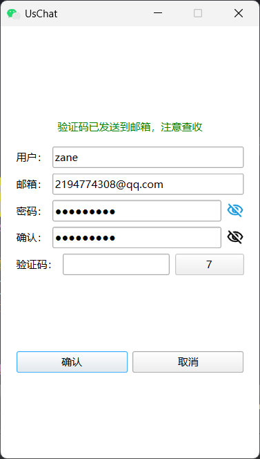
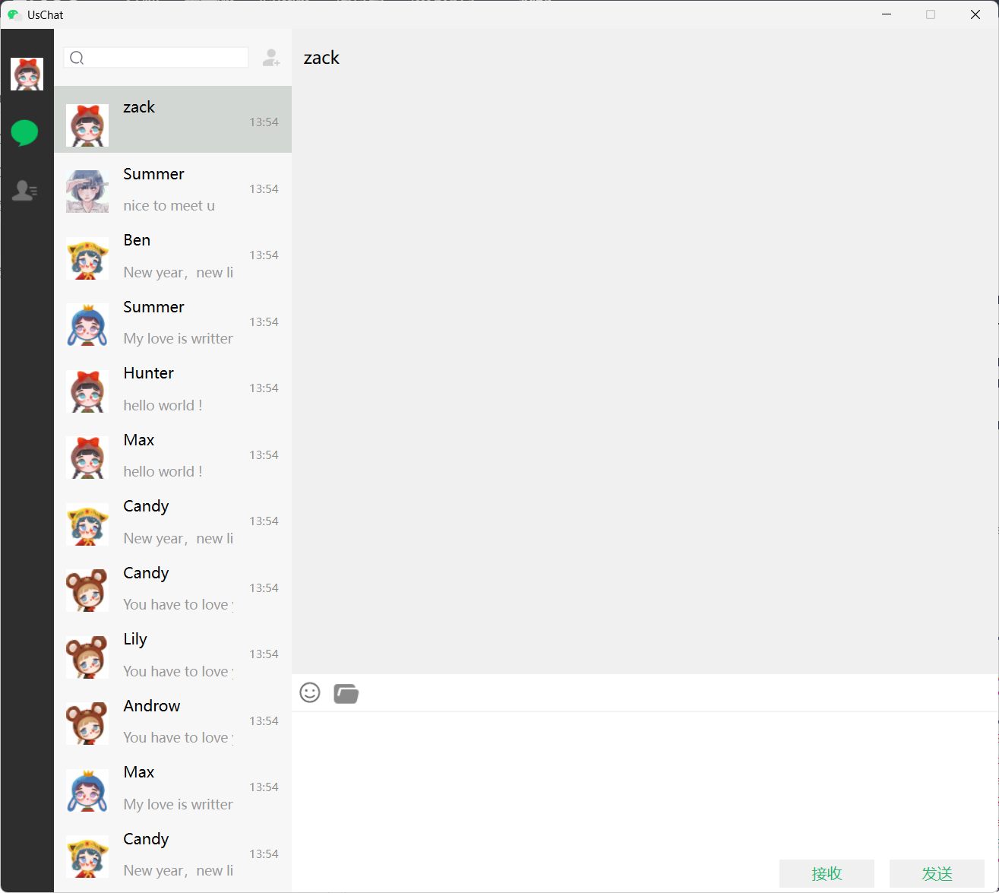
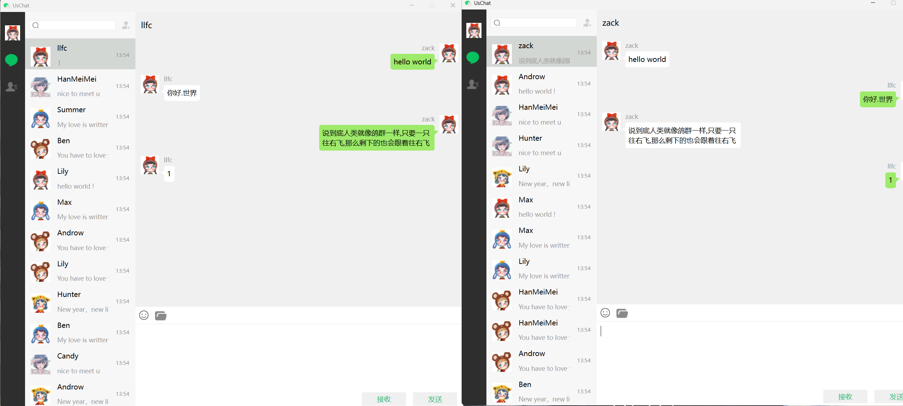

# UsChat
**UsChat** 是一个基于 C++ 的即时通讯聊天系统实战项目，涵盖了多种现代 C++ 开发技术，适合希望系统学习网络编程、并发处理、跨平台 GUI 开发和分布式服务设计的开发者。

## 项目特点包括:
- 使用 **gRPC** 实现高效的远程过程调用
- 基于 **Boost.Asio** 和 **Beast** 构建 HTTP/TCP 服务
- 采用 **Qt** 开发跨平台客户端界面
- 集成 **Redis** 实现缓存与消息队列
- 支持邮箱验证、好友申请、聊天记录等完整功能
## 技术栈
- 语言：C++17
- 网络通信：gRPC、Boost.Asio、Beast
- 界面开发：Qt
- 数据库：MySQL
- 缓存与消息队列：Redis
- JSON 处理：JsonCpp
- 开发环境：Visual Studio（Windows 平台）
# 设计思路

**ClientA / ClientB**：客户端，基于 Qt，实现用户注册、登录、聊天功能。
**GateServer**：网关服务器，接收客户端请求并转发给对应模块。
**VarifyServer**：验证码服务，负责发送邮箱验证码。
**StatusServer**：状态服务，负责为登录用户分配ChatServer，并生成 token。
**ChatServer1 / ChatServer2**：聊天服务，负责与客户端通信，并通过 gRPC 与其他聊天服务器通信。
**Redis**：存储 token 与 uid 映射，保存各 ChatServer 当前连接数, 保存邮箱验证码等。
**MySQL**：用于持久化存储用户注册信息。
# 运行截图






---

**下面是一些制作笔记, 笔者表达不清楚请见谅**
# GateServer
回顾一下这个HTTP网关是怎么做的吧：
1. 读取config文件，使用了ConfigMgr
2. 进入CServer中，通过ioc. run和CServer中的async_accept混合使用, 使得服务端能一直监听, 实际上只有一个 `async_accept` 在等待, 等待请求然后运行回调函数
3. 每次Start都会从Ioc池中取一个来捕获链接，如果成功链接，那么用这个ioc创建socket并进行异步读，处理请求，并设置一个定时器来记录这一次的处理是否成功
4. 处理请求，我们是在HttpConnction中处理的，在这里，我们将TCP改为短链接，因为我们是用TCP模拟HTTP的，然后具体处理请求体里的链接，根据我们提前在LogicSystem中注册好的链接和对应的处理函数来进行不同的操作，因为LogicSystem是个单例，所以我们可以在HttpConnection中运行它
5. 操作完后当然要进行写回，因为是HTTP包，无论结果如何我们都应该返回一些信息。
6. 这一整个过程的网络连接我们是用boost来处理的，很方便，用起来和Servlet挺类似了，不过更加麻烦点
## boost实现http的测试
main函数中用io_context注册ctlr+c信号, 然后启动服务器,
服务器需要shared_from_this捕获自己来避免被消除
通过async_accept检测是否有连接, 而async_accept需要一个socket
socket需要一个io_context的上下文, 而socket放在HttpConnection中

连接后检测读请求, 如果有读, 那么根据request的请求方法调用相应的处理方式 
这个处理方式由LogicSystem实现, LogicSystem中有对应各种不同路径的处理方法, (字典完成)

处理完成后用async_write写出response即可

异步操作的回调函数,**当对应的异步操作完成时**（例如连接建立、数据读完、写完等），**Boost. Asio 的事件循环 `ioc.run()` 会触发这些回调执行**。
## HttpConnection
HttpConnection中有socket, buffer, request, response, socket通过从io_context中取出一个建立, 并且通过这个socket建立连接, buffer和request通过连接时的async_read得到 (因为是http连接所以HttpConnection的Start并没有像CServer的Start一样一直递归调用), 并且根据request的method分别处理post和get, 再根据request的target处理不同的访问url (传递给LogicSystem处理), 所以必须要传递HttpConnection, 所以HttpConection不是单例, 因为每个连接都会创建自己的HttpConnection, `shared_from_this()` 是为了延长生命周期

每个 `HttpConnection` 调用 `LogicSystem` 后运行的函数，其实是**同一个 lambda 函数对象**，**但是它操作的是传进来的不同的 `HttpConnection` 实例**，所以每次处理的是独立的数据。这就是为什么LogicSystem的完成这么麻烦的原因, 要用map然后要用RegGet在LogicSystem初始化的时候注册这些函数

设置response的keep_alive建立短链接, async_read处理时要设置超时断连
## boost实现http的get整体步骤
用acceptor的async_accept异步监听socket
如果有连接, 则用<font color="#ff0000">HttpConnection来管理</font>这个连接, 用 [[async_read]] 来检测读请求
接收到读请求后,<font color="#ff0000">进行处理</font>的同时设置[[../000-计算机大类/Linux高性能服务器编程/定时器|定时器]]检测发送超时 (如果超时了就会关闭链接, 或者由async_write来关闭这个定时器)
进行处理的是 底层的LogicSystem, 通过map来让已经注册了的 [[url处理]]相应的事务
注册在LogicSystem ([[单例模式|Singleton]]) 的构造函数里注册, 而<font color="#ff0000">LogicSystem能够访问HttpConnection</font>是通过shared_from_this () 智能指针来处理的

因为是Http, 所以建立之后就可以关闭了, 不用再次进行 [[async_read]] 来继续检测读请求
[[解析url]], [[url处理]]

现在来看， main需要一个类CServer，来监听，需要一个类HttpConnection来处理socket，这个处理类又可以延展出一个实现类LogicSystem

同样的，在Qt中，也就是前端，客户端，注册页面要发起请求，也需要一个类来处理，但这只是post，我们把post过去交给后端处理，在这类，我们用一个单例httpmgr来处理所有的请求，因为前端一次肯定只会发送一个请求
## 解析request的数据
buffers_to_string然后用**Json::Reader来完成Json的解析**
其实就是将**数据用Json形式读取后, 构造新的Json数据形式**, 再发送, 要注意用boost和json的语法

如果出错了也要将error写进response中
将要传的Json写好后, 转成string再用ostream写进response中
```c
// post，获取验证码的请求
RegPost("/get_varifycode", [](std::shared_ptr<HttpConnection> connection) {
	auto body_str = boost::beast::buffers_to_string(connection->_request.body().data());
	std::cout << "receive body is " << body_str << std::endl;
	connection->_response.set(http::field::content_type, "text/json");
	Json::Value root; //返回
	Json::Reader reader;
	Json::Value src_root; // 来源
	// 解析完放到src_root里
	bool parse_success = reader.parse(body_str, src_root);
	if (!parse_success) {
		std::cout << "Failed to parse Json data!" << std::endl;
		root["error"] = ErrorCodes::Error_Json;
		std::string jsonstr = root.toStyledString();
		beast::ostream(connection->_response.body()) << jsonstr;
		// 不是连接错误那种大错误
		return true;
	}

	if (!src_root.isMember("email")) {
		std::cout << "Failed to parse Json data!" << std::endl;
		root["error"] = ErrorCodes::Error_Json;
		std::string jsonstr = root.toStyledString();
		beast::ostream(connection->_response.body()) << jsonstr;
		// 不是连接错误那种大错误
		return true;
		
	}

	
	auto email = src_root["email"].asString();
	//Gate服务给验证服务发请求
	GetVarifyRsp rsp = VerifyGrpcClient::GetInstance()->GetVarifyCode(email);
	std::cout << "email is " << email << std::endl;
	root["erro"] = rsp.error();
	root["email"] = src_root["email"];
	std::string jsonstr = root.toStyledString();
	beast::ostream(connection->_response.body()) << jsonstr;
	return true;
});
```
## 配置文件管理ConfigMgr
配置文件的结构如下
```c
[Redis]
Host = 10.62.183.223
Port = 6379
Passwd = 123456
```
每一个中括号称为一个Section, 用一个结构体存储键对map
再用一个类存储Section与这个结构体,
其实就是大map嵌套小map, 用read_ini读取
## Io_context池
每个 `io_context.run()` 本质上是**同步阻塞的**，所以必须放到线程里跑, 因此给每个io_context分配一个线程thread

而io_context需要有占位任务, 要不然会直接退出, 因此给每个io_context分配一个work, 使 `run()` 永远不会自动退出，直到你 `work.reset()` 或者 `io_context.stop()`。
boost 库比较新没有work的可以用executor_work_guard

其实**两个io_context是互相分担压力的**, 因为内部其实是计数器从池里取出的, 所以每次取出都是交替的, 而我们从池中<font color="#ff0000">取io_context出来就是为了给某个HttpMgr配置socket的</font>, 所以其实总体来说就是每个io_context分担了一半的socket数
## grpc连接池
**每个 `Stub` 是一个客户端“远程代理”，相当于能调用远程 `GetVarifyCode()` 的对象**。

队列里的每个Stub都是unique的, 因此push和pop的时候要用move
利用cond的wait判断是否需要挂起该请求
[[grpc链接池|RPConPool]]
## 手动封装redis操作
这里的redisContext相当于一个封装了 [[socket]] 描述符、缓冲区、连接状态等信息的结构体, 代表与redis服务端之间的[[连接上下文]]

每个连接都要密码认证
[[redis常见操作]]
每个操作先从池子里取connect然后再执行redisCommand

而且每次执行redisCommand后都要freeReplyObject释放redisCommand执行后返回的redisReply所占用的内存
## 封装mysql连接池
**Driver用来获取连接**
**Schema指定数据库**

设置检测线程每**60秒作为保活机制防止连接断开或失效**, 因此封装Mysql的连接Connection和最后一次使用时间为SqlConnection

建立查询语句, 设置参数, 执行语句 (通过con)

因为归还连接是每次都必须查询都必须做的, 因此我们可以用**Defer来简化代码, 这个Defer就是利用生命周期, 在每次查询函数结束时, 在函数中创建的类也会销毁, 我们只需要在Defer中传入需要在函数结束时执行的语句就行了, 利用lambda函数注册**

这里用了MysqlMgr调用MysqlDao, MysqlDao中再跟mysql连接池打交道
## StatusServer客户端
更改proto, 加上一个GetChatServer的服务, 让StatusServer服务端返回host, port和token, GateServer再将这些返回给Qt客户端
然后qt就知道跟哪个ChatServer连接了

也用了连接池来管理, 跟连接邮箱的那个grpc的连接池一样
# StatusServer
| 名称        | 作用                                                    |     |
| --------- | ----------------------------------------------------- | --- |
| `builder` | 负责**配置和创建 gRPC Server**的构建器（配置阶段）, 监听地址, 安全策略, 注册服务实现 |     |
| `server`  | 真正的**gRPC Server 实例**（运行阶段）                           |     |

客户端发送邮箱与密码, GateServer通过邮箱与密码从Mysql中获取Uid
然后Gateserver将Uid发给StatusServer, 由StatusServer查Redis, **StatusServer将目前连接数最少的ChatServer找出来**, 再随机生成**token后(将uid和token绑定在redis中)**, 将token, ChatServer的host, port打包返回给GateServer, GateServer再返回给客户端
## 验证token
在获取登录请求, 获取生成token的同时将 uid和token插入到redis中

在ChatServer向StatusServer查询uid和token是否一致的时候, 查询redis, 如果查询到了就正常返回即可, 设置error为正确值, 所有grpc的返回类都有error参数
## 分布式管理ChatServer
###  分布式通信架构
- 每个 ChatServer 启动时同时启动 TCP 服务监听和 gRPC 服务监听；
- 使用 `ChatGrpcClient` 和 `ChatServiceImpl` 实现 ChatServer 之间的 RPC 通信；
- 可通过配置文件扩展支持多个 Peer Server，便于横向扩展。
- 对每个PeerChat都生成连接池, 只需要更改config. ini即可添加ChatServer

###  Redis 状态管理
- 每个 ChatServer 启动时在 Redis 中初始化自己的连接数；
- 服务器关闭时从 Redis 删除自己的连接数记录；
- 用户登录成功后，将用户 UID 和对应 ChatServer 的标识写入 Redis，支持跨服务转发；
- 每次登录都动态更新当前服务器的连接计数。
- StatusServer将当前连接数最小的ChatServer返回给需要登录的客户端

###  用户会话管理
- 通过 `UserMgr` 实现 UID 与 Session 的绑定与查询；
- 登录成功时绑定 Session，连接断开时移除绑定；
- 为后续扩展的强制下线、消息转发等提供基础。
# ChatServer
async_accept异步接收连接, 如果客户端发出链接请求，Boost. Asio 会自动完成 TCP 三次握手，调用 HandleAccept 回调函数。然后，服务端分配一个**新的 CSession 来处理这条连接**，并继续监听下一个客户端连接。

建立连接时, 要去StatusServer判断uid和toekn是否正确

- 每个连接 `accept` 成功就创建一个独立的 `CSession` 对象。
    
- 每个 `CSession` 持有自己的 socket 和 uuid，互不干扰。
    
- 所以 **每个客户端连接都有独立线程上下文和接收缓冲区**。
## 读
asyncReadFull (每次调用清空缓冲区) 接收读取长度, 还有读取超过读取长度后的回调函数
MsgNode封装暂存数据, 包含总长, 当前长度, 缓冲区, <font color="#ff0000">如果是要发送或者接收, 还要加上id</font>

先用asyncReadFull读取头部, [[将头部信息转换为本地字节序]]后, 将msgid和msg长度传入MsgNode中, 再用asyncReadBody继续读取包体, 读取包体完成后，**在回调中继续读包头**。以此循环往复直到读完所有数据。如果对方不发送数据，则回调函数就不会触发。不影响程序执行其他工作，因为我们采用的是asio异步的读写操作。

当然我们解析完包体后会调用LogicSystem单例将解析好的消息封装为逻辑节点传递给逻辑层进行处理。

而这个LogicSystem在第一次构造的时候会生成一个线程, 检测封装好的消息队列中是否有消息, 如果有则调用已经注册好了的handler去运行

如果是登录的消息, 那么将uid与session绑==定==
## 写
写的时候要加锁, 将要写的数据放到一个队列中, 只有队列为空的时候才能开始写入
每次写的时候写队头 用 [[async_write]], 写完之后执行回调函数, 这个回调函数会一直运行, 直到队列为空
# Qt客户端
## 完成注册功能
### 发送邮箱验证码
首先注册页面检测格式是否正确
如果正确, 则**通过HttpMgr发送Post请求, ID说明要干嘛, Mod说明是谁发的** (这里是注册页面)
<font color="#ff0000">HttpMgr先将url和数据打包成一个request, 然后发出post, 同时等待reply</font>(这个post是通过QNetworkAccessManager的post完成的)
reply返回后检测是否有错
如果正确, 那么发送信号给自己, 收到信号后, 这个信号槽函数根据mod再发送信号给回相应的页面 (这里是注册页面)
注册页面收到信号后, **首先根据检查错误码, 然后再检查json解析是否正确**
如果都正确, 那么根据**id**进行相应的处理 (handler处理, handler在页面初始化时注册好)
### 注册信息
首先判断信息是否都正确填写完毕, 再将这些信息用QJsonObject保存后, **发送给HttpMgr进行post**

同时注册页面要加上收到回复信号后的处理流程 (Handler中注册, 解析回报中的email并且更改tip)

GateSever中要完成验证码是否正确和用户是否存在的检测
### 获取邮箱验证码按钮升级
将获取邮箱的**button升级为TimerBtn,** 重写它的**mouseReleaseEvent**
点击时将按钮Enabled, 然后设置文本为计数器, **同时每1000毫秒调用一次_timer, timer绑定了每秒更改文本的函数**
### 显示和隐藏密码
用qss给出**六种状态**的不同展现形式
**显示和隐藏 + 鼠标是否悬浮**
升级输入框为ClickedLabel, 通过**设置状态 + repolish + update**变更图标

最后在注册页面中添加label (是否可视密码的label) 点击的响应函数
### 注册成功页面
切换到page2, 用**一个定时器每1000毫秒调用1次, 实现倒计时**

在返回按钮和取消注册按钮上发送切换回登陆页面的信号
### MainWindow切换页面
切换页面时信号也要重新注册, 因为原来的页面被销毁了, 也就无法继续连接
## HttpMgr
当同时发起多个 HTTP 请求时，通过 `req_id` 区分不同请求的响应。
通过 `mod` 参数将结果分发到不同信号，解耦业务模块。

shared_from_this保证HttpMgr不会被意外销毁

### **`_manager.post(request, data)` 的工作机制​**​

- ​**​异步非阻塞​**​：
    - `post` 方法会立即返回一个 `QNetworkReply` 对象，但实际 HTTP 请求是在后台线程处理的。
    - 调用 `post` 后，Qt 将请求加入事件循环，由操作系统处理网络通信。
- ​**​返回的 `QNetworkReply` ​**​：
    - 用于跟踪请求状态（如进度、错误、完成信号）。
    - 必须通过 `reply->deleteLater()` 安全释放资源。

## 重设密码
功能上与注册相差不大, 只是要在**GateServer中处理重置密码的post**请求, 在LogicSystem中注册新的post的url的处理函数
在sqlDao中完成检查邮箱和更新密码的功能即可, 内容都大差不差, 只需要一些细微修改
## 登录
检查一遍输入后交给HttpMgr去post, 然后根据回包判断是否出错, 没出错则将token和uid信息等交给TCPMgr去进行长连接, 长连接是否失败通过TCPMgr中与socket连接的connect进行判断

同样的, LogicSystem也要注册新的处理用户登录的url的函数
注意发回的还有StatusServer所查询的token和host
## TCPMgr
登陆页面要有连接Http的信号connect, 还要有连接成功信号的connect

初始化的时候用connect将socket的各种状态变化绑定一个函数

调用socket. connectToHost (si. Host, port); 进行异步连接

接收到数据的时候, 把连接缓冲区的包全部读到buffer中，然后循环处理每个包。每个包处理的时候获取头部并去掉，然后检查上一次的数据是否不够，如果这次发的数据还不够组成一次message的话，那么挂起，再等待数据，直到buffer中的数据能够组成一次message，那么就调用发送信号，将TCPMgr中存好的 message_id, message_len 还有 messageBody 进行处理。

连接好后就可以用TcpMgr发送信息了

为了保证线程安全, 我们可以将随时可能调用的函数作为槽函数完成
## 聊天页面
三个widget水平布局
设置margin为0, 水平fixed, 垂直expanding
一点边距可以调整space和扩展设置
使用各种widget搭建即可

点击样式可以和以前一样用qss来做, 并且在页面注册某组件的各种状态

搜索栏用action来做, 添加搜索图标和清除按钮在search_edit上, 用connect将触发条件和回调函数绑定

当搜索的时候显示search_list,

用户列表逻辑
当 ​**​鼠标进入列表区域​**​ 或 ​**​触发滚轮滚动​**​ 时，执行以下步骤：

1. ​**​监听事件类型​**​：
    - 若事件为 `QEvent::Enter`（鼠标进入），显示滚动条（`Qt::ScrollBarAsNeeded`）。
    - 若事件为 `QEvent::Leave`（鼠标离开），隐藏滚动条（`Qt::ScrollBarAlwaysOff`）。
2. ​**​处理滚轮事件​**​：
    - 捕获滚轮滚动角度（`QWheelEvent::angleDelta()`），计算滚动步数 `numSteps`。
    - 更新滚动条位置：`verticalScrollBar()->setValue()`。
3. ​**​检查滚动到底部​**​：
    - 计算当前滚动值 `currentValue` 和最大值 `maxScrollValue`。
    - 若 `maxScrollValue - currentValue <= 0`（触底），发送信号 `sig_loading_chat_user()` 触发加载更多数据。
4. ​**​终止事件传递​**​：返回 `true` 阻止事件继续传播。

qss设置滑动条字体页面等

用stackWidget实现页面内的内容切换
### ChatView
`ChatView` 类通过 `QScrollArea` 实现滚动容器，内部嵌套一个带垂直布局的 `QWidget` 作为消息项的容器。构造函数中构建主布局和滚动区域，将滚动条的垂直策略设为 `Qt::ScrollBarAlwaysOff` 初始隐藏，通过 ​**​事件过滤器​**​ 监听鼠标进入/离开事件：鼠标进入滚动区域时，若内容超出可视范围（`verticalScrollBar()->maximum() != 0`）则显示滚动条；离开时强制隐藏，实现 ​**​悬停显隐交互​**​。滚动条的布局被强制修改为右侧对齐，覆盖默认位置。

`appendChatItem` 方法将消息项插入到垂直布局的倒数第二位（占位弹簧之前），触发 `rangeChanged` 信号，在槽函数 `onVScrollBarMoved` 中检测 `isAppended` 标记，若为 `true` 则立刻滚动到底部，并通过 `QTimer::singleShot` 在 500ms 后重置标记，避免快速追加时重复滚动。但该机制存在 ​**​竞态风险​**​：若 500ms 内连续追加多次，可能只有最后一次触发滚动。

`removeAllItem` 遍历布局项并直接 `delete` 控件，存在 ​**​野指针风险​**​，应改用 `deleteLater` 安全释放。`prependChatItem` 和 `insertChatItem` 未实现，留空导致功能缺失。`paintEvent` 重写仅为继承样式，未添加自定义绘制逻辑。整个类的滚动条样式通过 `initStyleSheet` 预留接口，但实际代码为空，需后续通过 QSS 注入样式规则。

每个 `ChatView` 实例通过 `m_pScrollArea` 管理独立的消息项集合，滚动条和布局状态互不干扰，因此 ​**​无需单例模式​**​。事件过滤器中传递 `this` 指针，确保不同实例的事件逻辑隔离。`isAppended` 作为成员变量，仅作用于当前实例的滚动状态，不同 `ChatView` 的自动滚动互不影响。`LogicSystem` 若存在，需通过回调函数操作具体的 `ChatView` 实例，类似 HTTP 连接中每个请求独立处理的方式，避免全局状态污染。

## 添加资源文件
添加资源文件 ,add new, qrc
右键qrc文件, 添加现有文件, 然后放文件就行
Qlabel的pixmap增加图片
## 拖动布局
为了拖布局的时候好拖, 可以适当增加margin
垂直布局里嵌套水平布局, 如果有什么东西很大, 可以用Spacer挤一挤
## QT自动管理内存
用 Qt 的父子对象体系自动管理内存：
- 通过指定父对象（this）实现自动回收, 比如_login_dlg = new LoginDialog (this);
- setCentralWidget () 自动删除旧部件, 自动管理页面, 一次只显示一个页面
- show () 并非立即显示，而是将显示请求加入事件队列
## UI与Connect
connect (发送者, 信号, 接收者, 槽函数)
ui是用来读取当前界面所绘制前端的那些控件的, 同时也是我们操作控件的接口
## edit设置为密码模式
```
ui->lineEdit_Passwd->setEchoMode(QLineEdit::Password);
```
## 槽函数
右键转到槽 , click事件可以自动生成槽函数
## 添加网络库
在pro中加上QT       += core gui network, 添加网络库
## 发送请求的模板
发送http的post请求, 发送请求要用到请求的url，请求的数据 (json或者protobuf序列化)，以及请求的id，以及哪个模块发出的请求mod
## 定义各种类型
通过enum定义ErrorCode或者其他的什么枚举类型
## Style, qss
新建style文件夹, 再新建一个qss文件, 然后再qrc文件新加现有文件即可

用QFile读取, 读取成功后readAll转成QString
QLatin1String将QByte转成QString
然后QApplication设置即可

通过qss可以给字体的不同状态不同颜色显示
每次设置的时候需要刷新, 这样的功能同时也可以直接修改label的颜色来完成
# windows启动redis
修改conf, 端口号和启动密码
启动服务器.\redis-server. exe .\redis. windows. conf

启动客户端.\redis-cli. exe -p 6380 密码
# nodejs给邮箱发送验证码
config. json
读取时用json读取即可

因为transport. SendMail是异步函数 所以用new Promis将异步转成同步, 阻塞等待函数的运行, 这样函数外部就可以用await或then catch的方式处理了

用uuidv4随机生成验证码, 并且通过redis暂存验证码, 给验证码设置过期时间RedisCli. expire (key, exptime);

再proto文件的服务端定义了GetVarifyCode方法,
那么当客户端调用这个 RPC 方法时，gRPC 框架就会：

- 自动把客户端发来的 `GetVarifyReq` 塞进 `call.request`
    
- 把返回给客户端的 `GetVarifyRsp` 通过 `callback(null, response)` 发回


服务端初始化时，通过 `grpc.Server()` 创建一个服务监听对象，称为<font color="#ff0000"> gRPCServer，内部持有 socket</font>。调用 `bindAsync()` 方法时，gRPC 从系统的事件循环中获取一个 socket，绑定地址（如 `0.0.0.0:50051`），准备监听连接请求。

**客户端连接后，gRPC 会自动为其建立连接和数据通道**，并读取请求数据（类似于 C++ 中的 `async_read`），这些请求数据最终被封装进一个 `call` 对象中，它包含了解析后的请求信息，比如这里的 `call.request.email`，就相当于 HTTP 中 `request.body["email"]`。

接收到数据后，gRPC 内部会<font color="#ff0000">根据客户端请求的服务名和方法名</font>（比如 `VarifyService.GetVarifyCode`）去服务注册表中查找对应的处理函数。这个服务注册表就是通过 `server.addService()` 注册进去的 map：键是 `GetVarifyCode`，值是实现的处理函数（如 `GetVarifyCode(call, callback)`）。这个注册过程等价于 `LogicSystem::RegPost(...)`。

于是，gRPC 调用绑定的 `GetVarifyCode` 函数，传入请求内容 `call` 和用于响应客户端的 `callback`（相当于在 C++ 中通过 `connection->_response.body()` 写入响应数据）。在函数里就可以做所有逻辑处理：查 redis、发邮件、拼 JSON，然后再通过 `callback(null, response)` 发送响应。

而且由于 JavaScript 本身是事件驱动、单线程，Node. js 会在事件队列中处理每个连接、每次请求的回调，不需要像 C++ 手动写 `shared_from_this()` 保活逻辑。每次新请求进来，就重新调的处理函数，call 和 callback 是全新的对象，因此不会存在“数据重叠”问题。

package. json加上
  "scripts": {
    "serve": "node server. js"
  },
  这样直接输入npm run serve即可启动rgpc服务端  
# mysql配置
id设自增
刚开始运行的时候运行id = id + 1会报错, 因为id一开始是没有值的, 所以要用如下代码

```c

 -- 检查 user_id 表是否为空
 IF (SELECT COUNT(*) FROM `user_id`) = 0 THEN     
   -- 如果 user_id 表为空，初始化 id 为 1     I
   NSERT INTO `user_id` (id) VALUES (1); 
 ELSE     
   -- email也不存在，更新user_id表     
   UPDATE `user_id` SET `id` = `id` + 1; 
 END IF;
```

CREATE USER 'root'@'%' IDENTIFIED BY 'your_password_here';
GRANT ALL PRIVILEGES ON *.* TO 'root'@'%' WITH GRANT OPTION;
FLUSH PRIVILEGES;

[[事务]]就是一组操作，要么全部成功，要么全部失败。
在事务中如果用户已存在或者邮箱已存在, 那么result返回0
如果mysql执行错误, 那么result返回1
如果全都成功, 返回1
# 要配置的
boost, json, grpc, cmake, nasm, vcpkg, redis库, myqsl connector c++
[[mysql connector的dll要同步生成到运行目录]]

VS 属性管理器, Debug64添加新项目属性表

# 其他

[[enable_shared_from_this]]
[[atomic]]
[[condition_variable和mutex]]
[[grpc]]
[[boost]]
IPC_PRIVATE, 用它来创建的对象key属性值为0, 和无名管道类似

bind,
网络字节序 (大端模式), 高位存低地址
[[../000-计算机大类/Linux高性能服务器编程/timeval|timeval]]

[[inet_ntop]]
[[../000-计算机大类/TCP_IP网络编程/send|send]]
[[../000-计算机大类/TCP_IP网络编程/recv|recv]]

服务端客户端都要发送和接收信息, 那么就会把这两个工作分给两个进程, 而服务端要同时应对多个客户端, 因此需要在 [[../000-计算机大类/TCP_IP网络编程/fork|fork]] 下面再进行接受和发送

QT, 和java中的GUI编程还挺像
qmake-project生成工程文件
然后 [[makefile]] 运行就会生成可执行文件


```
/******************************************************************************
 * @file       %{CurrentDocument:FileName}
 * @brief      XXXX Function
 *
 * @author     Tao_z
 * @date       %{CurrentDate:yyyy\/MM\/dd}
 * @history    
*****************************************************************************/


```


建立窗口的时候，指定this，就可以与父进程绑定从而自动释放内存

刷新qss
```c
std::function<void(QWidget*)> repolish = [](QWidget* w){
    // 卸掉
    w->style()->unpolish(w);
    // 刷新
    w->style()->polish(w);
};
```
参数设置为QWidget指针就可以获取到所有的组件

CRTP

[[shared_ptr]]
[[奇异递归]]
[[QT的Http请求]]
序列化Serialize --> 字节流ByteArray --> 服务端收到 (组包) --> 字符串 (ByteArray) --> 转换成类对象 (反序列化)

服务器尽量不要主动关客户端， 可能造成timewait

如果两个头文件有互相包含，那么可以先声明， 然后再在cpp里面进行include

类的成员是引用类型，要在初始化列表进行初始化

[[config.ini]]
[[io_context]]
两种池的实现方式，一种全局单例 [[AsioIOContextPool]]，另一种普通队列

[[lock_guard和unique_lock的区别]]
[[shared_ptr和unique_ptr的区别]]

封装hredis，并且用到了线程池的概念，和grpc用的池一样
[[RedisMgr]]

node. js也要封装redis，不过node. js是“单线程的”，所以也没有池的概念

封装mysql链接的池，分了
池，DAO，和service（也就是Mgr）
那么，[[MysqlPool]]，[[MysqlDao]]，
MysqlMgr是实际操作数据库的，所以要用单例来实现，作为全局都能操作的对象

同时引入RAII的思想，也就是利用类的生命周期，实现类似go语言中defer的概念，[[Defer]]
## grpc
[[grpc]] 微软默认编译是mdd编译

接口和通信

注意编写 [[message.proto]] 的格式
