# UsChat
**UsChat** 是一个基于 C++ 的即时通讯聊天系统实战项目，涵盖了多种现代 C++ 开发技术，适合希望系统学习网络编程、并发处理、跨平台 GUI 开发和分布式服务设计的开发者。

## 项目特点包括:
- 使用 **gRPC** 实现高效的远程过程调用
- 基于 **Boost.Asio** 和 **Beast** 构建 HTTP/TCP 服务
- 采用 **Qt** 开发跨平台客户端界面
- 集成 **Redis** 实现缓存与消息队列
- 支持邮箱验证、好友申请、聊天记录等完整功能
## 技术栈
- 语言：C++17
- 网络通信：gRPC、Boost.Asio、Beast
- 界面开发：Qt
- 数据库：MySQL
- 缓存与消息队列：Redis
- JSON 处理：JsonCpp
- 开发环境：Visual Studio（Windows 平台）

## 目前实现的功能:
	AI聊天
	加好友
	私聊与群聊
	图片发送 
	语音, 视频通话
	扫脸登录
	
# 设计思路
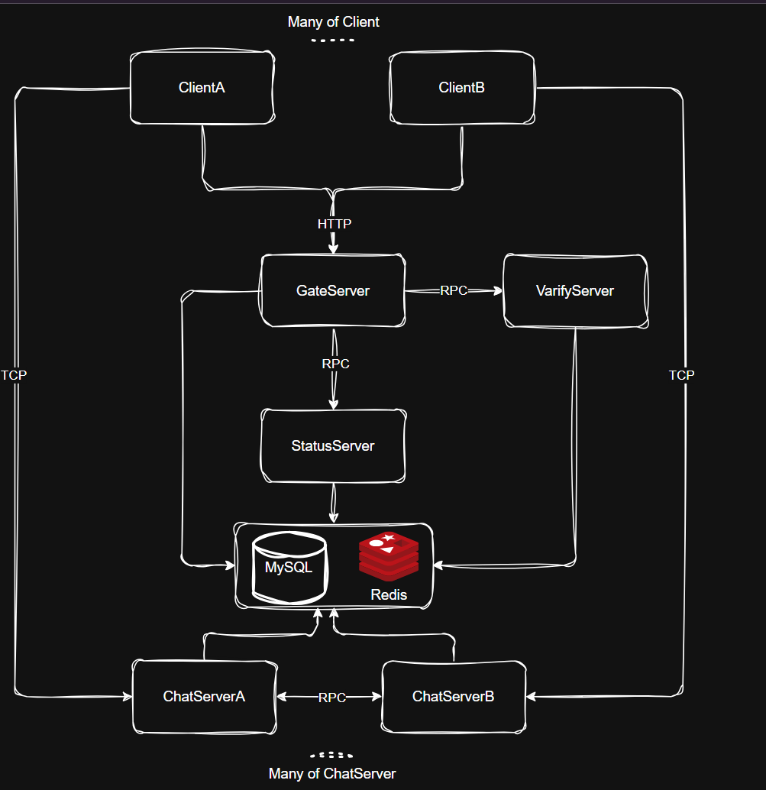
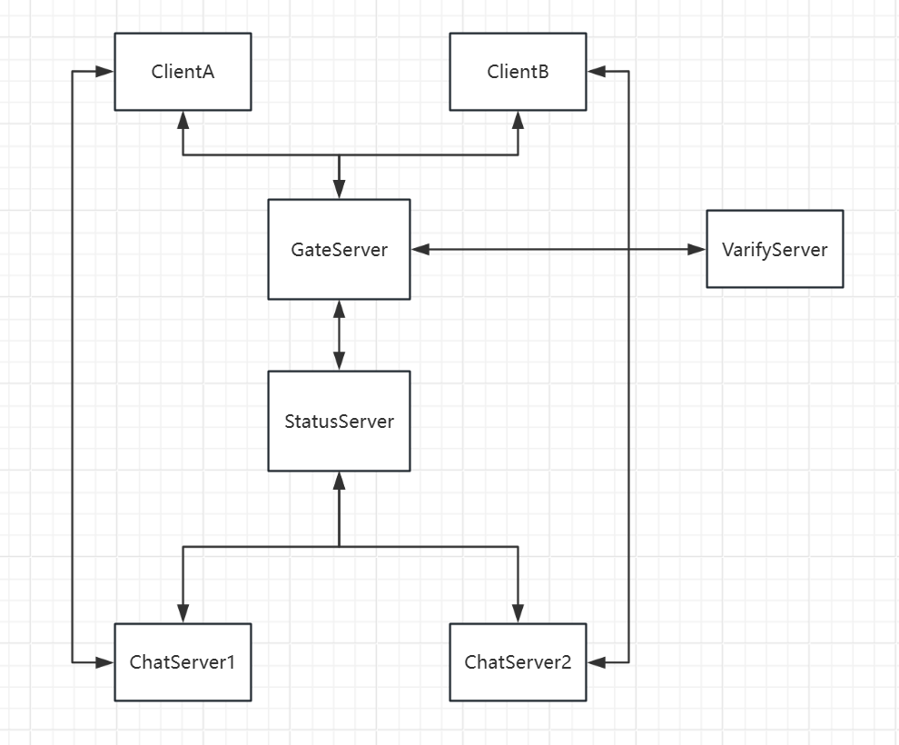
**ClientA / ClientB**：客户端，基于 Qt，实现用户注册、登录、聊天功能。
**GateServer**：网关服务器，接收客户端请求并转发给对应模块。
**VarifyServer**：验证码服务，负责发送邮箱验证码。
**StatusServer**：状态服务，负责为登录用户分配ChatServer，并生成 token。
**ChatServer1 / ChatServer2**：聊天服务，负责与客户端通信，并通过 gRPC 与其他聊天服务器通信。
**Redis**：存储 token 与 uid 映射，保存各 ChatServer 当前连接数, 保存邮箱验证码等。
**MySQL**：用于持久化存储用户注册信息。
# 运行截图
## 登录
支持扫脸登录和邮箱密码登录
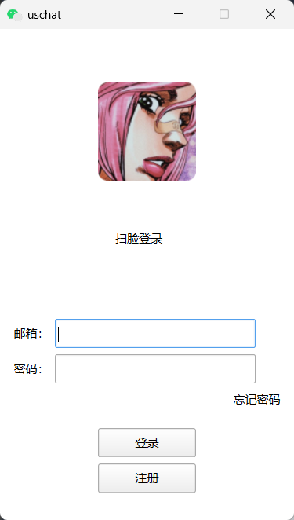
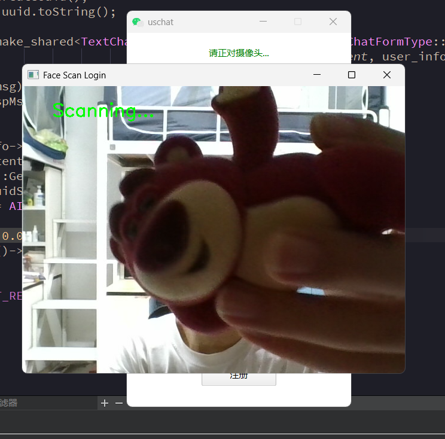

## AI聊天
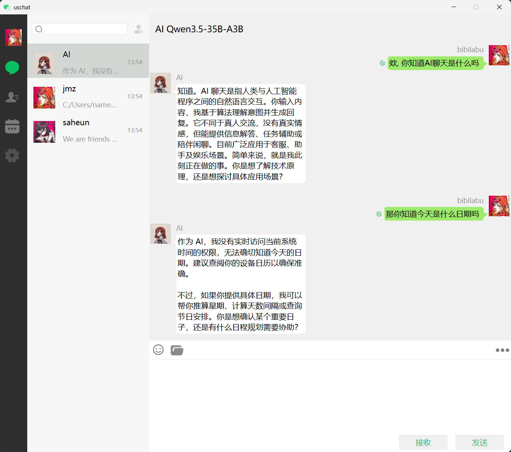
## 双端聊天
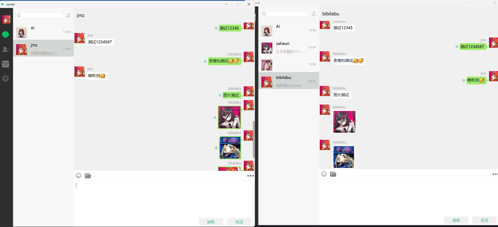
## 加好友
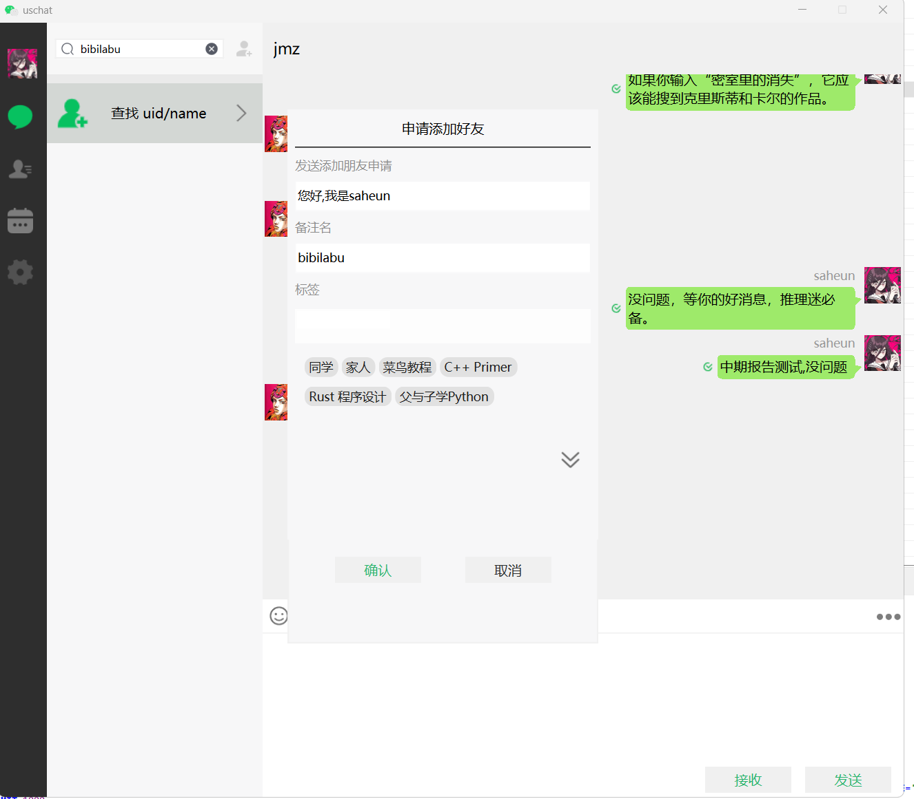

## 群聊
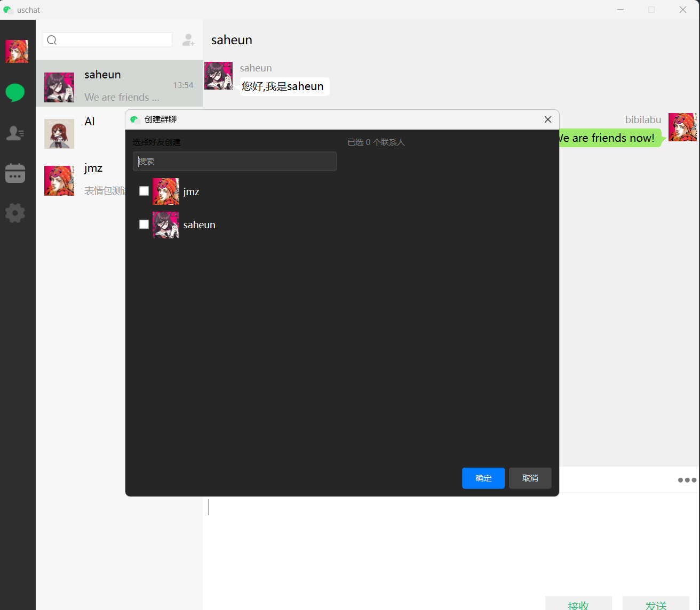
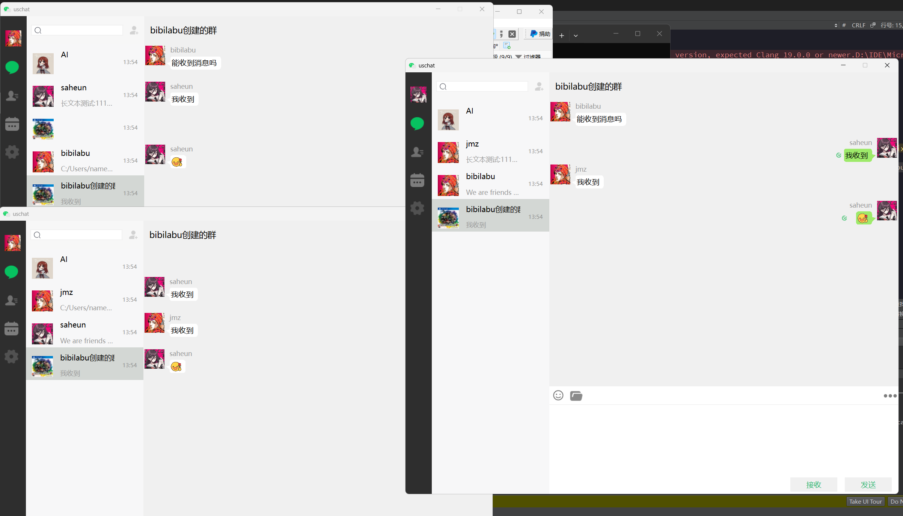
### 跨服
就算是跨服也能收到
saheun在chatServer2, 其他两个在chatServer1 (通过grpc转发)
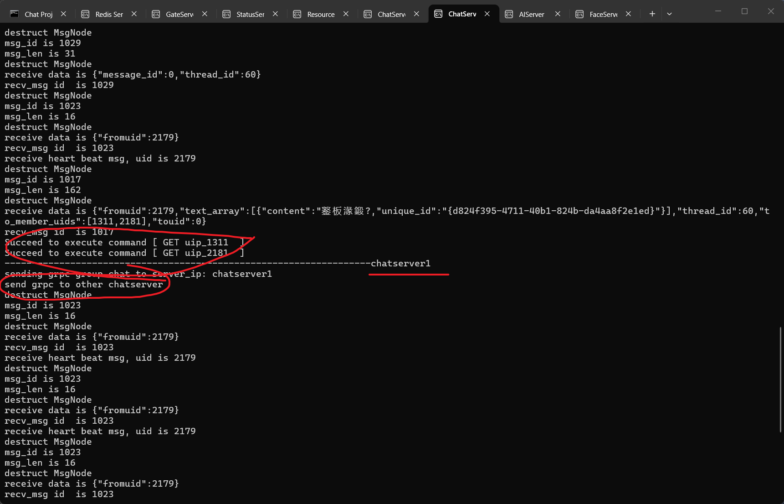
## 视频通话
bibilabu打给jmz
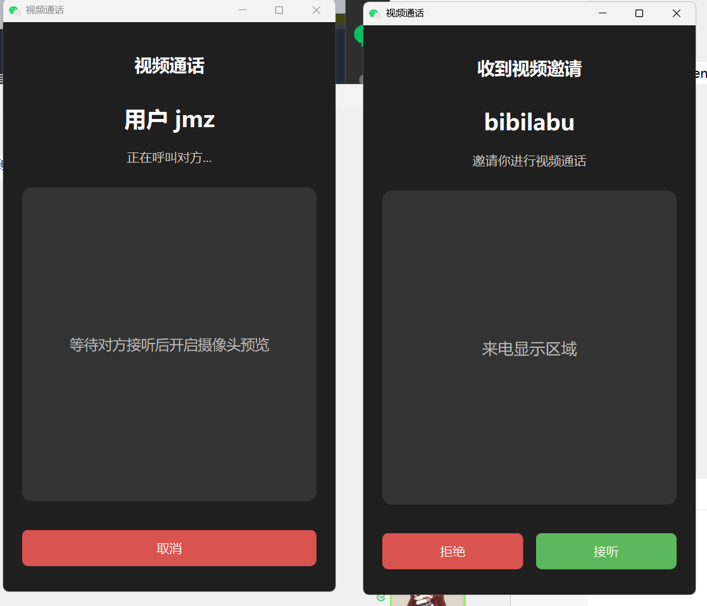
### 接通
由于笔记本只有一个摄像头 , 所以另一端视频用一个循环播放的视频代替
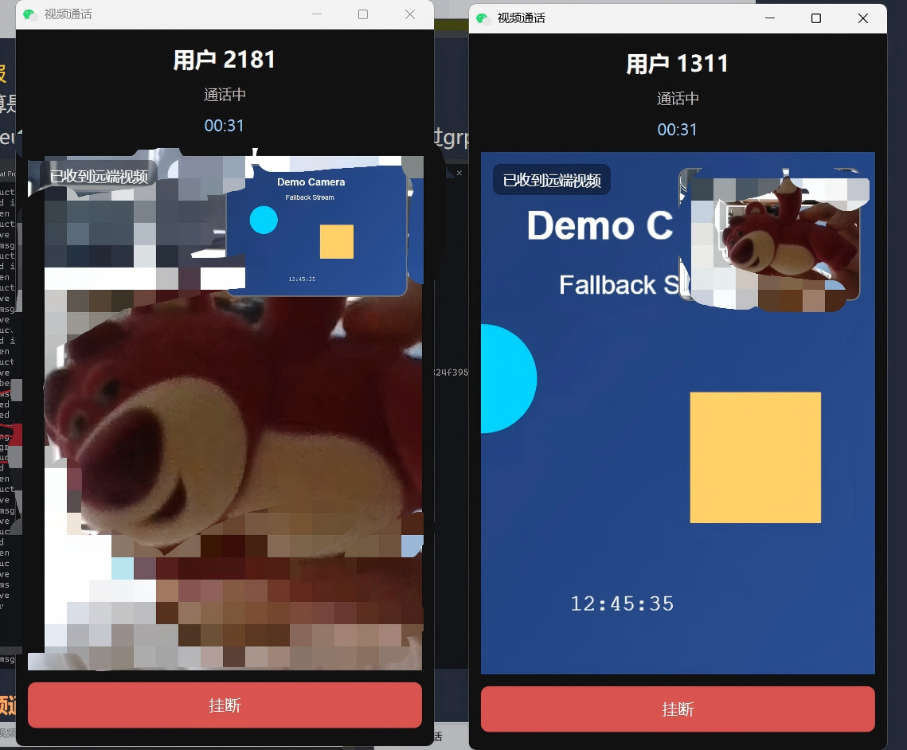
# Qt事件处理
## 原版
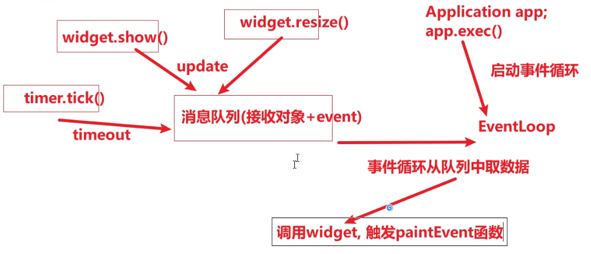
## 更改后
分开网络线程和主线程, 网络线程处理有关网络的请求
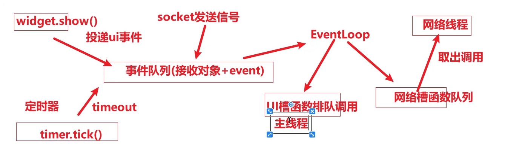
## [[Qt]], 槽函数在接收者所在线程触发
## 元对象系统
1. 信号和槽
2. 反射
3. 动态增加函数和属性
当我们信号和槽连接方式采用队列<font color="#ff0000">(不在一个线程, 跨线程)</font>, 那么信号的参数会被封装为<font color="#ff0000">元对象</font>, 投递到队列中
## 支持元对象
1. 继承QObject, 填写Q_OBJECT宏
2. 总之就是在类中定义好元数据, 定义需要实现默认构造, 然后用Q_DECLARE_METATYPE声明

## 信号和槽的连接方式
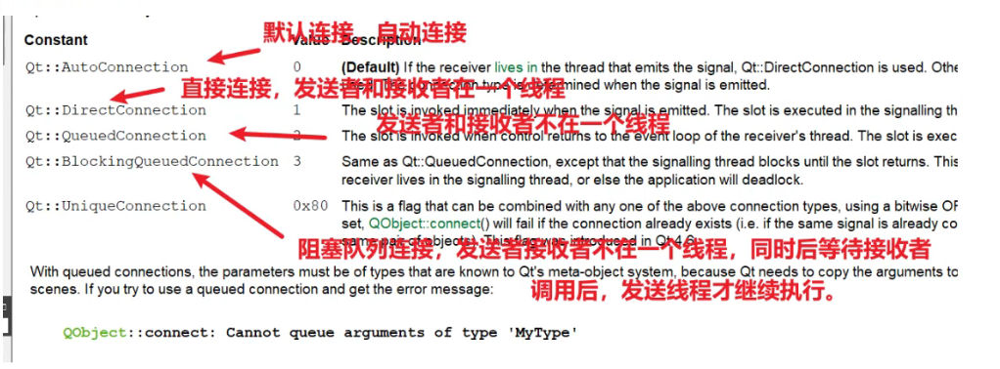
# Qt网络线程
在发送的时候新增发送队列, 封装当前正在发送的消息, 用bytesWritten来处理write后发送的信号, 进行继续写入或者取队列中的消息继续发送
# 人脸识别登录
## 客户端
opencv
YuNet 人脸检测, 检测图中是否有脸
SFace 提取人脸特征, 转成唯一数字
### 人脸录入分四步走
- **尺寸适配**：调用 `setInputSize`，告诉 AI 当前图片的实际宽高，避免图片拉伸导致识别不准。
    
- **人脸检测**：执行 `detect`。如果图中有脸，它会返回一个<font color="#ff0000">矩阵</font>，包含人脸的坐标、五官关键点（眼睛、鼻子、嘴角）。
    
- **人脸对齐 (`alignCrop`)**：这是识别准确的关键。AI 会根据五官位置，把歪着的人脸“扶正”并裁剪出来，确保后续提取的特征具有一致性。
    
- **特征编码 (`feature`)**：将对齐后的脸部图片输入 SFace 模型，最终输出一个 **1x128 维的浮点数向量**（<font color="#ff0000">即一串含有 128 个数字的数组</font>）。

然后矩阵转成Json发给服务端
### 人脸识别
隔100ms抓一帧, 发给服务器端, 并且要先进行活体检测
#### 活体检测
先定位人脸
然后裁剪(<font color="#ff0000">裁剪框需要放大, 要不然识别不到脖子下巴等</font>, **如果仅是detect的模型, 只会包含嘴巴, 眼睛, 眉毛**), 并且边缘保护, 放大1.5倍
归一化, 图像拉伸成80x80, 像素从0,255 到 0,1
模型推理 (2.7_80x80_MiniFASNetV2. onnx)

需要Softmax激活函数, 将返回值压缩至0到1


模型推理最后得到两个值, 则是假人概率和真人概率
如果是一个值, 则是活人的置信度

活体检测之后提取特征发给服务器端即可
## 服务端
收到向量, 归一化, 然后用内积计算, 余弦越接近1, 则越像, 很符合数学直觉
## [[FAISS]]
有个内存索引index
内容都要先变成Numpy数组之后才能放进索引, 匹配时也是一样, 反正有个接口调用就完事了

简单来说，FAISS 的核心工作流就是：**建索引 -> 统一标准塞数据 -> 统一标准查数据**。

# QT视频通话
1. **Qt 客户端业务层** 负责发起邀请、接听、拒绝、取消、挂断、更新界面状态。
    
2. **服务器信令层** 负责转发邀请、接听、挂断、offer、answer、ICE candidate。
    
3. **WebRTC 页面层** 负责真正建立 `RTCPeerConnection`，采集本地媒体，交换 SDP 和 ICE，播放远端视频。
    
**A 发起视频邀请 → B 接听 → A/B 建立 WebRTC 连接 → 页面拿到本地媒体 → 交换 offer/answer/ice → 播放远端视频 → 任一方挂断结束。**

Qt 侧是通过 `VideoCallManager + VideoCallWidget + WebRtcJsBridge + rtc_call.html` 共同完成的。`VideoCallManager` 负责业务状态和 TCP 信令收发，`VideoCallWidget` 负责界面和 `QWebEngineView`，`WebRtcJsBridge` 负责 JS 与 Qt 的桥接。

---
## 为什么不能“全都只靠 WebRTC”

因为 **WebRTC 只负责媒体和点对点协商机制，不负责业务信令传输**。

WebRTC 要建立连接，必须先交换这些信息：
- Offer
- Answer
- ICE Candidate

这些东西必须先通过某个“信令通道”送到对端。

<font color="#ff0000">现在的链路状态是:</font>
**网页 JS → Qt → 你的聊天 TCP → 服务器 → 对端 Qt → 对端网页 JS**

这就是标准的“**业务服务器转发 WebRTC 信令**”模式。  
**服务器转发信令，WebRTC 传媒体。**

## 完整流转过程

### 第 1 步：A 发起呼叫
### 第 2 步：服务器通知 B 来电
### 第 3 步：B 点击接听
### 第 4 步：服务器通知 A“对方已接听”
### 第 5 步：Qt 告诉网页启动 WebRTC
### 第 6 步：网页生成 Offer / Answer / ICE，回到 Qt
### 第 7 步：服务器转发 Offer / Answer / ICE
### 第 8 步：对端 Qt 再把远端 SDP / ICE 投给网页
### 第 9 步：连接成功

### 第 10 步：挂断

#### 本地主动挂断

Qt 调 `Hangup()`：

1. `SafeEmitQtHangup()` 通知网页收掉本地 RTCPeerConnection
    
2. 发 `ID_VIDEO_HANGUP_REQ` 给服务端
    
3. 发 `sig_call_local_hangup()`
    
4. `Reset()`
    

#### 远端挂断

收到 `ID_NOTIFY_VIDEO_HANGUP_REQ` 后：

1. `SafeEmitQtHangup()`
    
2. 发 `sig_call_hangup()`
    
3. `Reset()`
    

---
## 遇到的一些坑
### 坑 1：把“媒体”和“信令”混在一起理解了
### 坑 2：网页 Hangup 和 Qt Hangup 互相回调，造成重入/闪退
### 坑 3：`AcceptCall()` 提前改状态
### 坑 4：旧通话的 Offer / Answer / ICE 污染当前通话
### 坑 5：服务器协议层把 WebRTC Offer 当成“非法长度”，直接断开连接
### 坑 6：同机双开抢摄像头
## 总结
> 视频通话功能采用“Qt 业务层 + 服务器信令层 + WebRTC 页面媒体层”的三层架构。Qt 的 `VideoCallManager` 负责维护通话状态、发送邀请/接听/挂断请求，并把网页产生的 Offer、Answer、ICE 通过聊天 TCP 发给服务器；服务器只做信令转发与通话归属校验；网页 `rtc_call.html` 负责创建 `RTCPeerConnection`、采集本地媒体、设置本地/远端描述并播放远端流。开发过程中先修正了主叫/被叫启动角色、接听状态切换时机、旧消息 `call_id` 过滤，再解决了 Qt 与网页之间的 hangup 重入问题，最后排查出底层协议包长限制导致 Offer 被当成非法包，并为同机双开演示补充了媒体 fallback 方案。这样最终实现了从邀请、接听、信令协商到远端播放和挂断回收的完整闭环。
> 
> videocallmanager

本机本客户端当前状态
<font color="#ff0000">收到answer后</font>
<font color="#ff0000">onicecandidate</font>
<font color="#ff0000">自动找到一条通路, onconnectionstatechange</font>
<font color="#ff0000">ontrack, 显示画面</font>


qt WebChannel
处理权限
然后加载网页
## redis进行call_session的管理
将通话信息（发起人、接收人、视频/语音类型等）打包成 JSON 字符串，以 `call_session_<call_id>` 为 Key 存入 Redis。无论哪台服务器收到请求，直接去 Redis 里查，保证了**全局数据的一致性**。

去掉了原来依赖本地内存生成的 Call ID，改为使用 `发起方UID-接收方UID-当前时间戳` 来动态生成。

并且引入超时机制
# 视频通话接入QT
客户端A发送通话邀请, 客户端B回复接收
然后A发送webrtc_offer, B回复webrtc_answer
然后双方不断交换candidate
不断交换直到成功建立p2p连接, 然后端对端的传输视频流
## A 点击视频通话

- A 发 `call_invite` 给 B（走 ChatServer）
    
- B `call_accept`
    

## 两端开始 WebRTC 协商（signaling 仍走 ChatServer）

- A / B 各自创建 `PeerConnection`（通常在 accept 后创建更合理）
    
- **双方添加本地音视频 track**（getUserMedia/设备采集，Qt 侧就是创建 Audio/Video track）
    

## SDP 交换

- A（initiator）`CreateOffer` → `SetLocalDescription` → 发 `offer`
    
- B 收到 `offer` → `SetRemoteDescription`
    
- B `CreateAnswer` → `SetLocalDescription` → 发 `answer`
    
- A 收到 `answer` → `SetRemoteDescription`
    

## ICE candidate 交换（关键）

- 双方在 `OnIceCandidate` 回调里不断产生 candidate → **立刻发给对端**
    
- 对端收到后 `AddIceCandidate`
    

## 连接建立

- `PeerConnectionState/ICEConnectionState` 变成 `connected/completed`
    
- 远端视频 track 到达（`OnTrack`）即可播放
# 视频通话
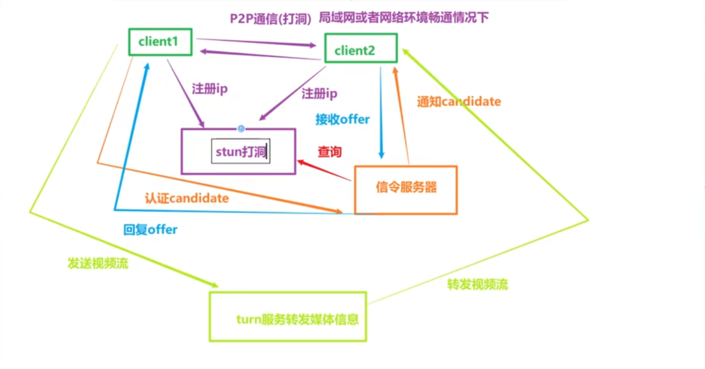
后加入的作为视频的发起方, 发送offer指令给信令服务器
## 视频流
摄像头 → 视频帧 → 编码 → 网络传输 → 解码 → 播放
## [[WebRTC核心原理]]
# Qt图片预览图
QPixmap显示
QImage数据处理

- `QImage` 支持逐像素访问
- `scanLine()`、`constScanLine()` 操作快
- 处理完再转成 `QPixmap` 给界面显示

图像状态
- `m_initialImage`：最开始加载的原图
- `m_originalImage`：已经应用过“正式编辑”的基础图
- `m_currentImage`：在基础图上叠加亮度/对比度之后的当前显示图

initial存储最初
original则处理像素, 每次处理都用original处理
current则用来展示, 每次处理完, 让current = original

基本上都是处理像素, 如果实现绘画, 则是处理mouse的event, 然后将线投影到图片上, (因为有时可能缩放, 但线的位置始终不变才对)
# QT切换会话缓存
线程缓存, 每个会话都对应一个缓存, 包含所有气泡item和消息内容


## 当用户从 A 会话切到 B 会话时：
### A 会话这边
1. 把当前聊天区里 A 的所有消息控件从布局里摘下来
2. 连同 A 的 `_unrsp_item_map`、`_base_item_map` 一起存入 `_thread_ui_cache[A]`
### B 会话这边
3. 先看 `_thread_ui_cache[B]` 里有没有缓存
4. 如果有：
    - 直接把缓存控件重新塞回聊天区
    - 恢复 B 对应的两张 map
5. 如果没有：
    - 从 `ChatThreadData` 遍历消息
    - 调 `AppendChatMsg()` / `AppendAiChatMsg()` 一条条创建 UI
    - 显示后，后续再把这批控件作为 B 的缓存保存起来
# 聊天图片的上传与下载
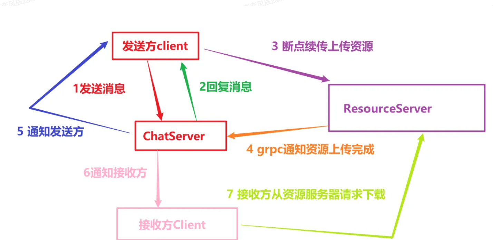
发送端发送图片时, 发送ID_IMG_CHAT_MSG_REQ给ChatServer, 目的是通过ChatServer上传图片的信息, 发送端收到ChatServer的回包后, 组织图片信息到UserMgr
然后发送ID_FILE_INFO_SYNC_REQ给ResourceServer, 让资源服务器获得图片信息, 如果没发完, 则会循环发送ID_IMG_CHAT_UPLOAD_REQ, 直到上传完毕, 客户端更新ui界面, 资源服务器通知ChatServer, ChatServer通知接收端从资源服务器下载图片 (ID_NOTIFY_IMG_CHAT_MSG_REQ)

接收端从资源服务器下载好然后更新界面即可, 比较简单 (ID_IMG_CHAT_DOWN_REQ)

# 聊天持久化
每个会话一个thread_id(会话线程), 每个消息一个message_id

私聊的时候, 两个用户的id可以先排序再插入, 这样方便后续查数据
或者不排序将数据插入两次也可以
或者拼成一个字符串

消息大可以 分表或者分库

登录时, 查看是否有聊天记录, 如果没有则向服务器请求, 有的话也要跟服务器同步未接受的消息

## 列表增量处理
客户端自身已经有的会话就不用再查了, 从最后一个thread_id开始查找即可, 这是会话, 点击会话才会有聊天记录
## 客户端登录
发送最大的message_id和thread_id给服务器, 
每次查page_size + 1, 如果满足 + 1, 那么后面还有, 不满足的话就可以判断已经查完 
## 游标cursor模式, 而不是offset
不需要全表扫描, 保证性能
## 首次单聊
chat_thread中, 创建thread_id
private_chat中创建chat

可能会出现多个服务器并发创建的情况
因此查询有没有会话的时候需要加锁
**在mysql语句中运用FOR UPDATE也会锁定查询行 (行级锁)**
而且要保证A的查询和修改是连贯进行的
### 创建流程
查询private_chat中是否存在会话
不存在则在chat_thread中创建
然后再在private_chat中插入

上面的运行流程在并发的时候可能插入两个重复的记录
解决方案: 把这个封装成一个事务即可
## Qt中的数据又要管理又要显示
所以两边都使用智能指针持有数据
## 会话列表
包含对话的数据, 还有消息的列表, 还有是谁跟你进行聊天的
## 消息类的两种形式
如果是接收消息, 那么不用缓存, 用msg_id管理消息
如果是发送消息, 要先发送给server, 再由server发送给接收者, **因此要进行缓存**(等待server的回包), 用unique_id管理消息, server回包会带有msg_id
## 会话类
这里的会话类就是下图的ChatMgr, 管理该会话内的各种数据
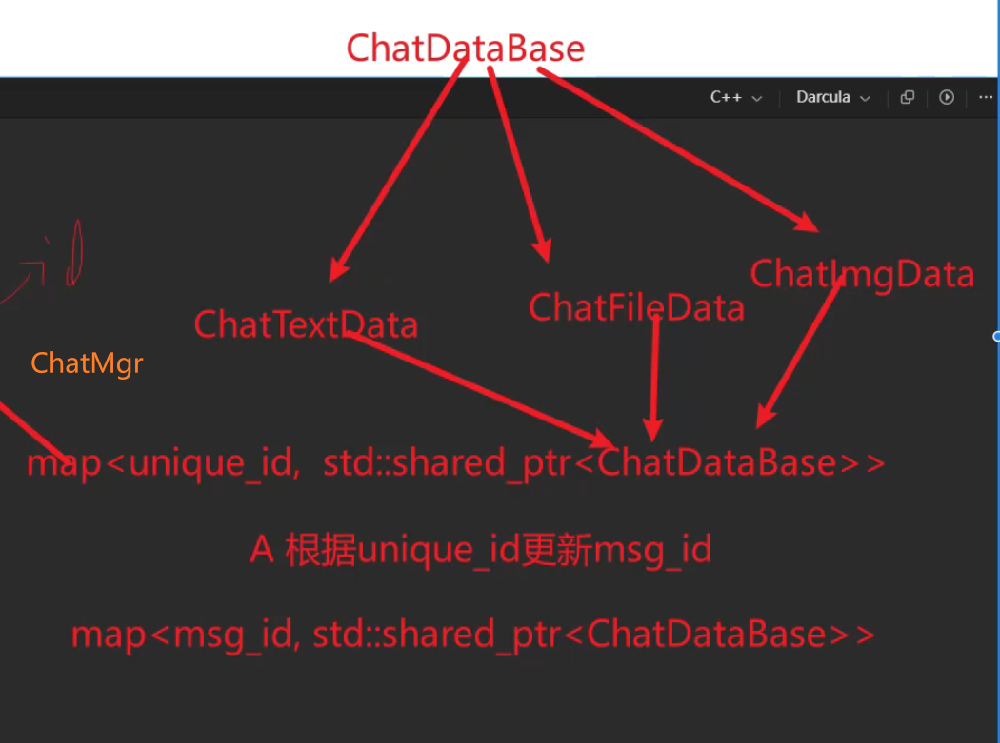

一个服务可以有多个集群, 每一个集群里还可以部署不同的服务, 集群内部的服务器的通信用的是grpc, 集群直接通过消息队列去通信
## 好友认证后
认证后, 数据库中就要有两个用户的好友信息
然后还有创建一个会话, 因为添加好友的时候带有请求信息 (你好, 我是xx)
好友信息要操控frined表和friend_apply表
创建会话又要操控chat_thread生成唯一id, 根据这个id生成private_chat, 还要把消息存储到chat_message中
## 聊天记录增量加载
分页加载,
用一个下标来判断接下来要加载的会话,
把一个会话的消息加载完, 也就是load_more为false的时候, 就可以将会话下标往后移

# 聊天页面
chatpage控制聊天页面, 点击会话切换页面, 这个数据从哪来?
数据存到userMr中, 一个客户端维护一个userMgr
userMgr中又thread_id对应的每一个会话的数据
而每个会话的数据中有一个存放消息的map
把消息放在这里面即可

收发的数据不一致
通过修改json数据和客户端还有服务端存储mysql逻辑终于把bug修复了
# 心跳实现
timer绑定到io_context, 即可每隔x秒调用一次
用async_wait来绑定函数
## 锁的逻辑, 分布式锁和线程锁互相嵌套的解决方法
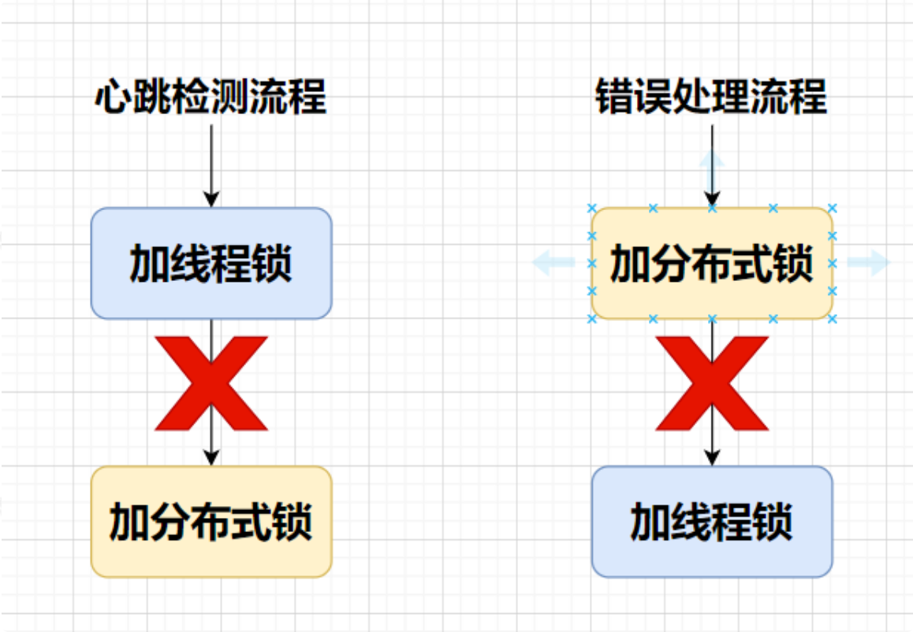
### 统一锁的获取顺序
先拿分布式锁在拿线程锁

使用带超时的尝试锁 + 重试/回退策略
### 合并锁或升级锁策略
放在一个类里, 先加锁的后解锁
### 只用分布式锁或线程锁
### 利用redis Lua 脚本保证原子性
## 每个Server的连接数可以用心跳来维护
每一次都是循环遍历session的map来确定当前服务器的连接数的, 每次都是hset在redis中重新设定的
## 报错排查
shared_from_this 是用内存去操作的
而如果在构造函数中调用shared_from_this的话就会报错
因为还没有分配内存

timer不能跟server耦合, 而且timer获取server和cancel的时机要跟server解耦合才行, 要不然无法优雅退出
# 头像框编辑
QStandardPaths:: AppDataLocal, 也就是AppData 的文件夹
本地的头像就放到这个目录内的avatars子目录

图片, 裁剪框, 放缩后的图片, 本质上就是这三个内容的一应用
# 锁的精度
mysql外层mgr代理dao连接池, 对外暴露接口而不是池子

把锁的精度变小, 获取值的时候才加锁

在mysql和redis的心跳中, 将锁的精度变小, 在获取连接的时候才加锁, 而不是在加锁到整个函数中, 搞得一个线程的获取锁时要占用很久

获取池的数量时加锁, 用一个原子int来存储失败的连接个数
**只要取出的时候和放回的时候加锁就可以保证线程安全了**
其他的内容可以在锁外执行, 这就是锁粒度的降低
# 文件传输
## 需求
限制文件大小, 长连接传输, 传输进度
包体, id2字节, 长度4字节,  数据
资源路径和输出路径
## 槽函数解耦合
发送信号调用槽函数来发送消息, **Qt跨进程发信号会送到队列里**(增加处理线程时, 将this改成处理线程即可), 也就是LogicMgr中创建的worker线程, <font color="#ff0000">QT的信号和槽是天然的队列</font>
## 处理粘包
处理粘包问题, 先取出包头, 再判断缓冲区的大小是否大于包头和数据体的长度, 大于的话截取即可

MTU最大1500字节, 传输文件的时候要进行切割, 当然TCP底层也会切割
通过Base64编码, 服务器也要Base64解码

## ASIO服务池
Iocontext由池管理, 而不是由Session管理, Session创建后放入map中管理, 然后启动 (开始监听)
## 异步不是递归
异步读再调用本函数, 不是递归, 不在一个线程之内, 可以理解为**注册**
## 服务端读数据
服务端读取数据的时候要转换为本地字节序, 整体流程是先读包头再读包体, 读完包体后将数据放入处理队列, 再读包头<font color="#ff0000"> (TLV)</font>
## 进度条
进度条用progressBar来实现, 设置value
## io_context和worker解绑
unique_ptr, reset的时候会自动调用析构函数, 这样就能够做一个io_context与worker的解绑
## lambda捕获self, 组成闭包
通过lambda表达式捕获, 也就是值

shared_from_this, 能够跟外部的智能指针共享计数, 要不然用this构造的shared_ptr只有一个计数, 伪造一个闭包
## 多线程传输
### 线程池处理, 很麻烦
如果用线程池来处理任务队列的话, 可能会因为数据的分包问题而出现很大的麻烦, 比如每个包处理速度不一致, 完成顺序不一致, 这样就又需要一个线程去管理这些分包的机制, 而且可能还不止一个客户端在发送数据, 也就是说这个管理线程还要在多个客户端的发包之间进行处理 , 很麻烦
### **按照任务划分**
也就是按照文件的名字哈希后, 分派给不同的线程 (有不同的队列)
一个逻辑队列 或者多个逻辑队列, 分给不同的任务处理线程
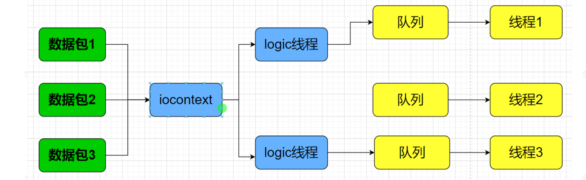
### 总结
也就是说
**LogicSystem下有很多个worker, 每个worker有一个队列, 有一个线程**

外部有任务时就**根据名字哈希**, 将任务放到一个worker的任务队列中, 然后worker自己就会去消费这个队列 (要对队列加锁)

消费队列的时候就会根据已经注册好的handler**继续往深处调用**, 比如这里是文件传输, 那么就将这个任务再传给<font color="#ff0000">FileSystem下面的worker</font>, 这个worker也一样有一个队列, 一个线程
# 消息放到其他线程的队列中进行处理, 但在本线程完成之后会自动将消息进行发送
## 情况
此时就可能会出现其他线程还没处理完, 本线程就直接将消息发送出去的结果
解决这个问题, 我们可以在处理线程中添加一个callback函数成员
即 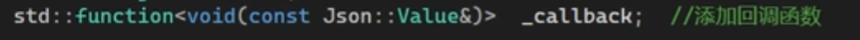
这个时候本线程就可以构造callback, 然后将callback传递给处理消息的线程
## 构造
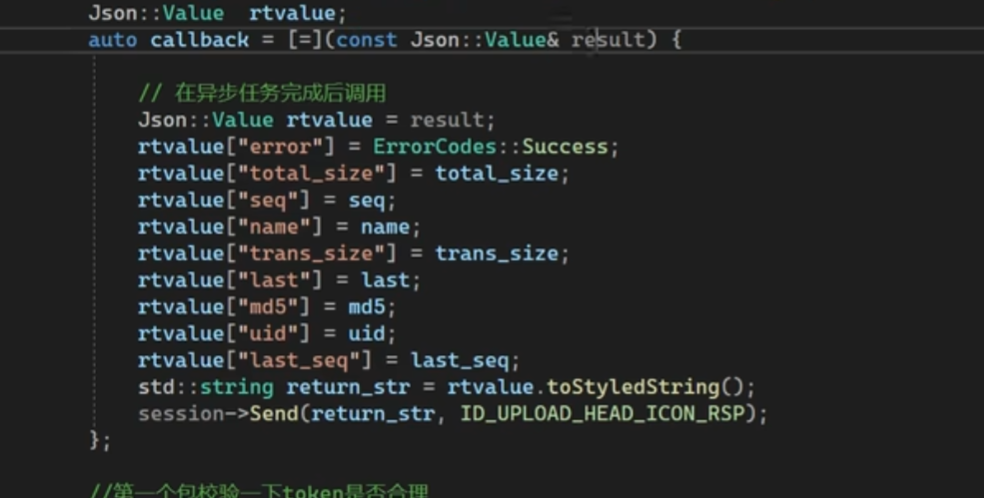
## 传递
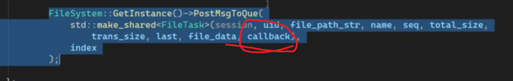
# 拥塞窗口
一个客户端发送聊天文件, 客户端会将文件分成多个小文件, 多个文件汇总到FileMgr然后统一发送, 这里发送也只是添加到发送队列
如果文件很大就会塞满发送队列, 导致服务器一直只接收该客户端发来的文件

# 死锁防止
## 两客户端同时建立相互之间的会话时
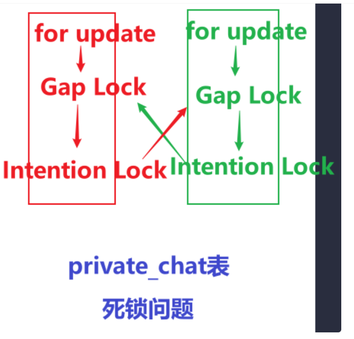
两边同时建立聊天的时候, 会因为互相获取间隙锁而死锁
### 原因
意向锁会被**间隙锁和临键锁阻塞**, 但不会阻塞其他的意向锁
### 解决
先insert再select (乐观)
先尝试插入,如果失败说明已存在,再查询
## 两边同时确认加好友时可能会死锁
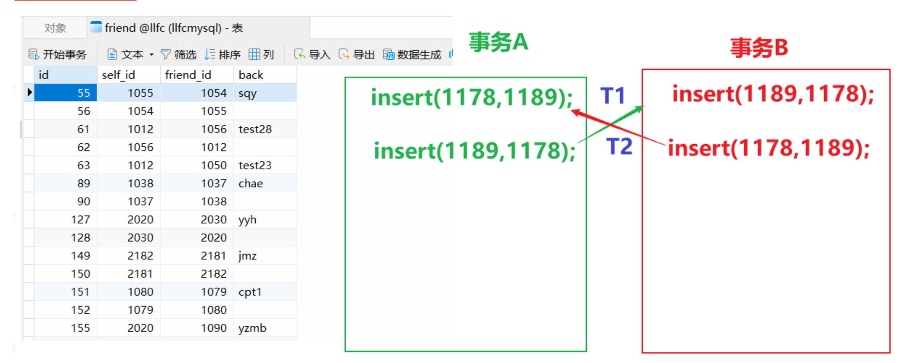
### 解决
保证插入顺序
insert, 左边小右边大即可, 这样事务B就不会开始
# 单线程踢人逻辑
## 分布式锁
通过redis的原子操作设置键
唯一的UUID识别持有者
需要有超时机制

redis控制的上下文, 锁名, 有效期, 获取锁的最大等待时间
"SET %s %s **NX** EX %d"
锁名 和 UUID 还有 过期时间, NX = Not eXists, EX = Expire
### LUA解锁, 防止误删, 需要原子操作
EVAL后面跟上了一个LUA脚本, 再后面是键的个数, LUA是<font color="#ff0000">原子操作的</font>
**指明键的数量就可以了, 值的数量会自动判断**

```c
if redis.call('get', KEYS[1]) == ARGV[1] then
    return redis.call('del', KEYS[1])
else
    return 0
end
```


在查询redis之前加锁, 锁在redis上, 使用
## 踢人逻辑
登录和下线都会写redis
登录会写session
下线会清空session

发送的时候对方离线
### B登A登
直接踢
### B登A下
A先下, 就是正常的登录逻辑
A后下, 发现uid对应的session不是自己, 那就不管
## 锁的精度
分布式锁和线程锁的范围要搞清除
不同服务器加分布式锁, 同一个服务器靠线程锁来保证并发安全
# 跨服踢人逻辑
单线程一个服务器的话, 就算多个线程redis内部也会保证线程安全 **(对登录来说)**
## 负载均衡时也需要加锁
<font color="#ff0000">登陆完成</font>的时候会修改redis, 而其他人<font color="#ff0000">尝试登录</font>的时候会读redis
## 不主动调用close
要不然可能产生大量的TIME_WAIT, 只是通知然后让对方关闭
## grpc需要添加踢人通知
chatserver之间通知踢人
## 僵尸进程
如果踢了但客户端没确定, 那么会导致僵尸进程, 不过数据发不出来, 因为CSession已经更改, 可以通过心跳检测来清除僵尸进程

# GateServer
回顾一下这个HTTP网关是怎么做的吧：
1. 读取config文件，使用了ConfigMgr
2. 进入CServer中，通过ioc. run和CServer中的async_accept混合使用, 使得服务端能一直监听, 实际上只有一个 `async_accept` 在等待, 等待请求然后运行回调函数
3. 每次Start都会从Ioc池中取一个来捕获链接，如果成功链接，那么用这个ioc创建socket并进行异步读，处理请求，并设置一个定时器来记录这一次的处理是否成功
4. 处理请求，我们是在HttpConnction中处理的，在这里，我们将TCP改为短链接，因为我们是用TCP模拟HTTP的，然后具体处理请求体里的链接，根据我们提前在LogicSystem中注册好的链接和对应的处理函数来进行不同的操作，因为LogicSystem是个单例，所以我们可以在HttpConnection中运行它
5. 操作完后当然要进行写回，因为是HTTP包，无论结果如何我们都应该返回一些信息。
6. 这一整个过程的网络连接我们是用boost来处理的，很方便，用起来和Servlet挺类似了，不过更加麻烦点
## boost实现http的测试
main函数中用io_context注册ctlr+c信号, 然后启动服务器,
服务器需要shared_from_this捕获自己来避免被消除
通过async_accept检测是否有连接, 而async_accept需要一个socket
socket需要一个io_context的上下文, 而socket放在HttpConnection中

连接后检测读请求, 如果有读, 那么根据request的请求方法调用相应的处理方式 
这个处理方式由LogicSystem实现, LogicSystem中有对应各种不同路径的处理方法, (字典完成)

处理完成后用async_write写出response即可

异步操作的回调函数,**当对应的异步操作完成时**（例如连接建立、数据读完、写完等），**Boost. Asio 的事件循环 `ioc.run()` 会触发这些回调执行**。
## HttpConnection
HttpConnection中有socket, buffer, request, response, socket通过从io_context中取出一个建立, 并且通过这个socket建立连接, buffer和request通过连接时的async_read得到 (因为是http连接所以HttpConnection的Start并没有像CServer的Start一样一直递归调用), 并且根据request的method分别处理post和get, 再根据request的target处理不同的访问url (传递给LogicSystem处理), 所以必须要传递HttpConnection, 所以HttpConection不是单例, 因为每个连接都会创建自己的HttpConnection, `shared_from_this()` 是为了延长生命周期

每个 `HttpConnection` 调用 `LogicSystem` 后运行的函数，其实是**同一个 lambda 函数对象**，**但是它操作的是传进来的不同的 `HttpConnection` 实例**，所以每次处理的是独立的数据。这就是为什么LogicSystem的完成这么麻烦的原因, 要用map然后要用RegGet在LogicSystem初始化的时候注册这些函数

设置response的keep_alive建立短链接, async_read处理时要设置超时断连
## boost实现http的get整体步骤
用acceptor的async_accept异步监听socket
如果有连接, 则用<font color="#ff0000">HttpConnection来管理</font>这个连接, 用 [[async_read]] 来检测读请求
接收到读请求后,<font color="#ff0000">进行处理</font>的同时设置[[../000-计算机大类/Linux高性能服务器编程/定时器|定时器]]检测发送超时 (如果超时了就会关闭链接, 或者由async_write来关闭这个定时器)
进行处理的是 底层的LogicSystem, 通过map来让已经注册了的 [[url处理]]相应的事务
注册在LogicSystem ([[单例模式|Singleton]]) 的构造函数里注册, 而<font color="#ff0000">LogicSystem能够访问HttpConnection</font>是通过shared_from_this () 智能指针来处理的

因为是Http, 所以建立之后就可以关闭了, 不用再次进行 [[async_read]] 来继续检测读请求
[[解析url]], [[url处理]]

现在来看， main需要一个类CServer，来监听，需要一个类HttpConnection来处理socket，这个处理类又可以延展出一个实现类LogicSystem

同样的，在Qt中，也就是前端，客户端，注册页面要发起请求，也需要一个类来处理，但这只是post，我们把post过去交给后端处理，在这类，我们用一个单例httpmgr来处理所有的请求，因为前端一次肯定只会发送一个请求
## 解析request的数据
buffers_to_string然后用**Json::Reader来完成Json的解析**
其实就是将**数据用Json形式读取后, 构造新的Json数据形式**, 再发送, 要注意用boost和json的语法

如果出错了也要将error写进response中
将要传的Json写好后, 转成string再用ostream写进response中
```c
// post，获取验证码的请求
RegPost("/get_varifycode", [](std::shared_ptr<HttpConnection> connection) {
	auto body_str = boost::beast::buffers_to_string(connection->_request.body().data());
	std::cout << "receive body is " << body_str << std::endl;
	connection->_response.set(http::field::content_type, "text/json");
	Json::Value root; //返回
	Json::Reader reader;
	Json::Value src_root; // 来源
	// 解析完放到src_root里
	bool parse_success = reader.parse(body_str, src_root);
	if (!parse_success) {
		std::cout << "Failed to parse Json data!" << std::endl;
		root["error"] = ErrorCodes::Error_Json;
		std::string jsonstr = root.toStyledString();
		beast::ostream(connection->_response.body()) << jsonstr;
		// 不是连接错误那种大错误
		return true;
	}

	if (!src_root.isMember("email")) {
		std::cout << "Failed to parse Json data!" << std::endl;
		root["error"] = ErrorCodes::Error_Json;
		std::string jsonstr = root.toStyledString();
		beast::ostream(connection->_response.body()) << jsonstr;
		// 不是连接错误那种大错误
		return true;
		
	}

	
	auto email = src_root["email"].asString();
	//Gate服务给验证服务发请求
	GetVarifyRsp rsp = VerifyGrpcClient::GetInstance()->GetVarifyCode(email);
	std::cout << "email is " << email << std::endl;
	root["erro"] = rsp.error();
	root["email"] = src_root["email"];
	std::string jsonstr = root.toStyledString();
	beast::ostream(connection->_response.body()) << jsonstr;
	return true;
});
```
## 配置文件管理ConfigMgr
配置文件的结构如下
```c
[Redis]
Host = 10.62.183.223
Port = 6379
Passwd = 123456
```
每一个中括号称为一个Section, 用一个结构体存储键对map
再用一个类存储Section与这个结构体,
其实就是大map嵌套小map, 用read_ini读取
## Io_context池
每个 `io_context.run()` 本质上是**同步阻塞的**，所以必须放到线程里跑, 因此给每个io_context分配一个线程thread

而io_context需要有占位任务, 要不然会直接退出, 因此给每个io_context分配一个work, 使 `run()` 永远不会自动退出，直到你 `work.reset()` 或者 `io_context.stop()`。
boost 库比较新没有work的可以用executor_work_guard

其实**两个io_context是互相分担压力的**, 因为内部其实是计数器从池里取出的, 所以每次取出都是交替的, 而我们从池中<font color="#ff0000">取io_context出来就是为了给某个HttpMgr配置socket的</font>, 所以其实总体来说就是每个io_context分担了一半的socket数
## grpc连接池
**每个 `Stub` 是一个客户端“远程代理”，相当于能调用远程 `GetVarifyCode()` 的对象**。

队列里的每个Stub都是unique的, 因此push和pop的时候要用move
利用cond的wait判断是否需要挂起该请求
[[grpc链接池|RPConPool]]

池子是否关闭, 链接放到队列里, 保证唯一性用unique_ptr
mutex配合condition
## 手动封装redis操作
这里的redisContext相当于一个封装了 [[socket]] 描述符、缓冲区、连接状态等信息的结构体, 代表与redis服务端之间的[[连接上下文]]

每个连接都要密码认证
[[redis常见操作]]
每个操作先从池子里取connect然后再执行redisCommand

而且每次执行redisCommand后都要freeReplyObject释放redisCommand执行后返回的redisReply所占用的内存
## 封装mysql连接池
**Driver用来获取连接**
**Schema指定数据库**

设置检测线程每**60秒作为保活机制防止连接断开或失效**, 因此封装Mysql的连接Connection和最后一次使用时间为SqlConnection

建立查询语句, 设置参数, 执行语句 (通过con)

因为归还连接是每次都必须查询都必须做的, 因此我们可以用**Defer来简化代码, 这个Defer就是利用生命周期, 在每次查询函数结束时, 在函数中创建的类也会销毁, 我们只需要在Defer中传入需要在函数结束时执行的语句就行了, 利用lambda函数注册**

这里用了MysqlMgr调用MysqlDao, MysqlDao中再跟mysql连接池打交道
## StatusServer客户端
更改proto, 加上一个GetChatServer的服务, 让StatusServer服务端返回host, port和token, GateServer再将这些返回给Qt客户端
然后qt就知道跟哪个ChatServer连接了

也用了连接池来管理, 跟连接邮箱的那个grpc的连接池一样
# StatusServer
| 名称        | 作用                                                    |     |
| --------- | ----------------------------------------------------- | --- |
| `builder` | 负责**配置和创建 gRPC Server**的构建器（配置阶段）, 监听地址, 安全策略, 注册服务实现 |     |
| `server`  | 真正的**gRPC Server 实例**（运行阶段）                           |     |

客户端发送邮箱与密码, GateServer通过邮箱与密码从Mysql中获取Uid
然后Gateserver将Uid发给StatusServer, 由StatusServer查Redis, **StatusServer将目前连接数最少的ChatServer找出来**, 再随机生成**token后(将uid和token绑定在redis中)**, 将token, ChatServer的host, port打包返回给GateServer, GateServer再返回给客户端
## 验证token
在获取登录请求, 获取生成token的同时将 uid和token插入到redis中

在ChatServer向StatusServer查询uid和token是否一致的时候, 查询redis, 如果查询到了就正常返回即可, 设置error为正确值, 所有grpc的返回类都有error参数
## 分布式管理ChatServer
### ✅ 分布式通信架构
- 每个 ChatServer 启动时同时启动 TCP 服务监听和 gRPC 服务监听；
- 使用 `ChatGrpcClient` 和 `ChatServiceImpl` 实现 ChatServer 之间的 RPC 通信；
- 可通过配置文件扩展支持多个 Peer Server，便于横向扩展。
- 对每个PeerChat都生成连接池, 只需要更改config. ini即可添加ChatServer

### ✅ Redis 状态管理
- 每个 ChatServer 启动时在 Redis 中初始化自己的连接数；
- 服务器关闭时从 Redis 删除自己的连接数记录；
- 用户登录成功后，将用户 UID 和对应 ChatServer 的标识写入 Redis，支持跨服务转发；
- 每次登录都动态更新当前服务器的连接计数。
- StatusServer将当前连接数最小的ChatServer返回给需要登录的客户端

### ✅ 用户会话管理
- 通过 `UserMgr` 实现 UID 与 Session 的绑定与查询；
- 登录成功时绑定 Session，连接断开时移除绑定；
- 为后续扩展的强制下线、消息转发等提供基础。
# ChatServer
<font color="#ff0000">登录时先将登录数设为零 (redis中)</font>
<font color="#ff0000">单独起一个线程处理grpc的服务</font>

async_accept异步接收连接, 如果客户端发出链接请求，Boost. Asio 会自动完成 TCP 三次握手，调用 HandleAccept 回调函数。然后，服务端分配一个**新的 CSession 来处理这条连接**，并继续监听下一个客户端连接。

建立连接时, 要去StatusServer判断uid和toekn是否正确

- 每个连接 `accept` 成功就创建一个独立的 `CSession` 对象。
    
- 每个 `CSession` 持有自己的 socket 和 uuid，互不干扰。
    
- 所以 **每个客户端连接都有独立线程上下文和接收缓冲区**。
## 读
asyncReadFull (每次调用清空缓冲区) 接收读取长度, 还有读取超过读取长度后的回调函数
MsgNode封装暂存数据, 包含总长, 当前长度, 缓冲区, <font color="#ff0000">如果是要发送或者接收, 还要加上id</font>

先用asyncReadFull读取头部, [[将头部信息转换为本地字节序]]后, 将msgid和msg长度传入MsgNode中, 再用asyncReadBody继续读取包体, 读取包体完成后，**在回调中继续读包头**。以此循环往复直到读完所有数据。如果对方不发送数据，则回调函数就不会触发。不影响程序执行其他工作，因为我们采用的是asio异步的读写操作。

当然我们解析完包体后会调用LogicSystem单例将解析好的消息封装为逻辑节点传递给逻辑层进行处理。

而这个LogicSystem在第一次构造的时候会生成一个线程, 检测封装好的消息队列中是否有消息, 如果有则调用已经注册好了的handler去运行

如果是登录的消息, 那么将uid与session绑==定==
## 写
写的时候要加锁, 将要写的数据放到一个队列中, <font color="#ff0000">只有队列为空的时候才能开始写入</font>
<font color="#ff0000">每次写的时候写队头</font> 用 [[async_write]], 写完之后执行回调函数, 这个回调函数会一直运行, <font color="#ff0000">直到队列为空</font>
## 查询用户信息
得到客户端传来的json字符串, 然后反序列化, 从中获取uid,
先查redis, 再查mysql, 如果是查mysql, 那么还要写入redis
利用defer发送回包, 回包中包含数据和ID
## 发送添加好友通知
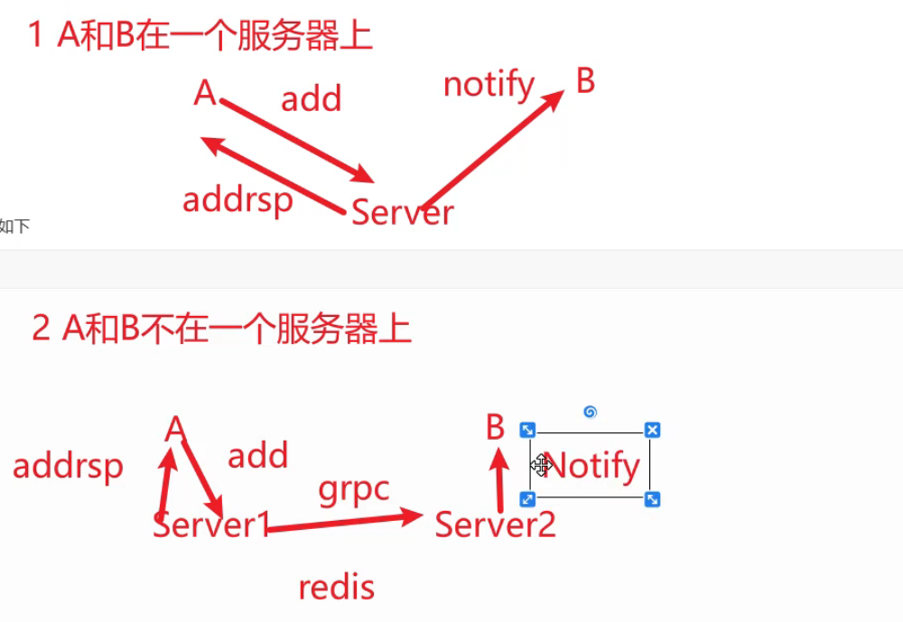
整体和上一条一样
是将好友申请插入到对应的mysql表中
然后查询redis, 看对方的id在哪个ChatServer上
如果是同一个ChatServer, 那么直接发送即可
如果不在, 则转发到其他ChatServer, 如果在线则发送
## 同意添加好友
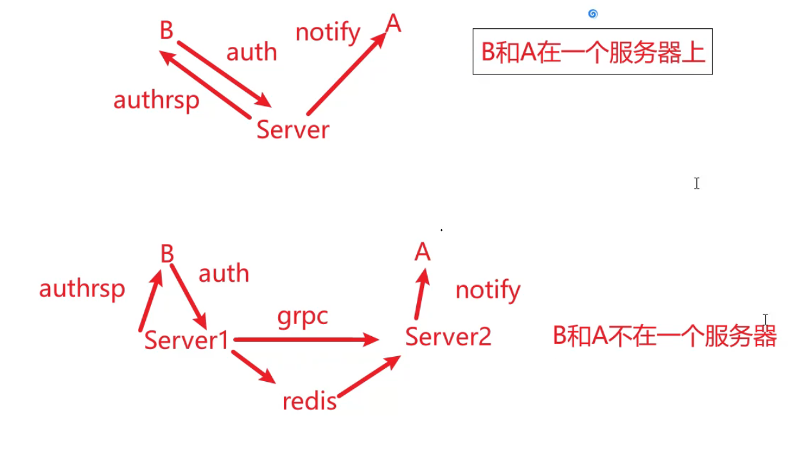
更新数据库, 查找对方所在的ChatServer, 然后通知对方认证通过
收到认证通过后, 如果对方在线, 那么发送通知, 要不然就直接返回, 什么都不做

---
# Qt客户端
## 完成注册功能
### 发送邮箱验证码
首先注册页面检测格式是否正确
如果正确, 则**通过HttpMgr发送Post请求, ID说明要干嘛, Mod说明是谁发的** (这里是注册页面)
<font color="#ff0000">HttpMgr先将url和数据打包成一个request, 然后发出post, 同时等待reply</font>(这个post是通过QNetworkAccessManager的post完成的)
reply返回后检测是否有错
如果正确, 那么发送信号给自己, 收到信号后, 这个信号槽函数根据mod再发送信号给回相应的页面 (这里是注册页面)
注册页面收到信号后, **首先根据检查错误码, 然后再检查json解析是否正确**
如果都正确, 那么根据**id**进行相应的处理 (handler处理, handler在页面初始化时注册好)
### 注册信息
首先判断信息是否都正确填写完毕, 再将这些信息用QJsonObject保存后, **发送给HttpMgr进行post**

同时注册页面要加上收到回复信号后的处理流程 (Handler中注册, 解析回报中的email并且更改tip)

GateSever中要完成验证码是否正确和用户是否存在的检测
### 获取邮箱验证码按钮升级
将获取邮箱的**button升级为TimerBtn,** 重写它的**mouseReleaseEvent**
点击时将按钮Enabled, 然后设置文本为计数器, **同时每1000毫秒调用一次_timer, timer绑定了每秒更改文本的函数**
### 显示和隐藏密码
用qss给出**六种状态**的不同展现形式
**显示和隐藏 + 鼠标是否悬浮**
升级输入框为ClickedLabel, 通过**设置状态 + repolish + update**变更图标

最后在注册页面中添加label (是否可视密码的label) 点击的响应函数
### 注册成功页面
切换到page2, 用**一个定时器每1000毫秒调用1次, 实现倒计时**

在返回按钮和取消注册按钮上发送切换回登陆页面的信号
### MainWindow切换页面
切换页面时信号也要重新注册, 因为原来的页面被销毁了, 也就无法继续连接
## HttpMgr
当同时发起多个 HTTP 请求时，通过 `req_id` 区分不同请求的响应。
通过 `mod` 参数将结果分发到不同信号，解耦业务模块。

shared_from_this保证HttpMgr不会被意外销毁

### **`_manager.post(request, data)` 的工作机制​**​

- ​**​异步非阻塞​**​：
    - `post` 方法会立即返回一个 `QNetworkReply` 对象，但实际 HTTP 请求是在后台线程处理的。
    - 调用 `post` 后，Qt 将请求加入事件循环，由操作系统处理网络通信。
- ​**​返回的 `QNetworkReply` ​**​：
    - 用于跟踪请求状态（如进度、错误、完成信号）。
    - 必须通过 `reply->deleteLater()` 安全释放资源。

## 重设密码
功能上与注册相差不大, 只是要在**GateServer中处理重置密码的post**请求, 在LogicSystem中注册新的post的url的处理函数
在sqlDao中完成检查邮箱和更新密码的功能即可, 内容都大差不差, 只需要一些细微修改
## 登录
检查一遍输入后交给HttpMgr去post, 然后根据回包判断是否出错, 没出错则将token和uid信息等交给TCPMgr去进行长连接, 长连接是否失败通过TCPMgr中与socket连接的connect进行判断

同样的, LogicSystem也要注册新的处理用户登录的url的函数
注意发回的还有StatusServer所查询的token和host
## TCPMgr
登陆页面要有连接Http的信号connect, 还要有连接成功信号的connect

初始化的时候用connect将socket的各种状态变化绑定一个函数

调用socket. connectToHost (si. Host, port); 进行异步连接

接收到数据的时候, 把连接缓冲区的包全部读到buffer中，然后循环处理每个包。每个包处理的时候获取头部并去掉，然后检查上一次的数据是否不够，如果这次发的数据还不够组成一次message的话，那么挂起，再等待数据，直到buffer中的数据能够组成一次message，那么就调用发送信号，将TCPMgr中存好的 message_id, message_len 还有 messageBody 进行处理。

连接好后就可以用TcpMgr发送信息了

为了保证线程安全, 我们可以将随时可能调用的函数作为槽函数完成
## 聊天页面
三个widget水平布局
设置margin为0, 水平fixed, 垂直expanding
一点边距可以调整space和扩展设置
使用各种widget搭建即可

点击样式可以和以前一样用qss来做, 并且在页面注册某组件的各种状态
### 重写eventFilter
处理点击事件, 如果不在搜索栏的位置中则关闭搜索栏 (利用mapFromGlobal来做)
### 搜索栏添加好友
#### 搜索栏本身
新建类继承QLineEdit, 重写函数时要记得调用基类的函数, 保证基类的行为得到执行

搜索栏的搜索按钮和清除按钮用action来做, 添加搜索图标和清除按钮在search_edit上, 用connect将触发条件和回调函数绑定

当搜索的时候显示search_list,
然后加上一个item, 这个item继承自ListItemBase, 因为ListItemBase已经重写paintEvent, 而且只需要定义好类型后就能直接插入list


#### 滑动栏
用户列表逻辑, 用eventfilter实现
当 ​**​鼠标进入列表区域​**​ 或 ​**​触发滚轮滚动​**​ 时，执行以下步骤：

1. ​**​监听事件类型​**​：
    - 若事件为 `QEvent::Enter`（鼠标进入），显示滚动条（`Qt::ScrollBarAsNeeded`）。
    - 若事件为 `QEvent::Leave`（鼠标离开），隐藏滚动条（`Qt::ScrollBarAlwaysOff`）。
2. ​**​处理滚轮事件​**​：
    - 捕获滚轮滚动角度（`QWheelEvent::angleDelta()`），计算滚动步数 `numSteps`。
    - 更新滚动条位置：`verticalScrollBar()->setValue()`。
3. ​**​检查滚动到底部​**​：
    - 计算当前滚动值 `currentValue` 和最大值 `maxScrollValue`。
    - 若 `maxScrollValue - currentValue <= 0`（触底），发送信号 `sig_loading_chat_user()` 触发加载更多数据。
4. ​**​终止事件传递​**​：返回 `true` 阻止事件继续传播。

如果不是这些事件, 那么还是运行基类的eventFilter
搜索栏的mode是用来控制searchlist的, state是说明现在是在聊天记录页面还是用户列表页面

如果已经到达底部, 那么加载新的用户头
加载的时候用loadingDialog显示在最上层, 设为透明, 其他的控件的删去, 大小设为父窗口大小
gif用QMovie加载
#### 用户聊天记录头部ChatUserWid
先定义好这种widget模板, 然后加入到list中

因为在不同的地方都会有类似这种的模板, 所以为这些模板创建一个基类
具体的模板只需要设置信息然后确定是哪一类模板即可

在加入list的时候, 设置wid的大小, 设置模板类型即可
#### 放在链表中的Item统一基类, 放item进list中
展示红点只需要show和hide即可,
分为不同的item即可实现一个链表中的各个样式, 分割线, 分组等

<font color="#ff0000">创建自定义item, 创建原生QListWidgetItem, 将原生item加到list中, 然后再用自定义item替换原生item</font>

在item点击信号的处理槽中
先根据item选取到widget
再将widget转换成子类 (我们自己定义的item)
然后取出item的类型, 不同的类型进行不同的操作即可
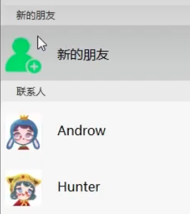
### 搜索后弹出对话框
这个对话框可以继承自ChatItemBase, 而且new的时候要show
智能指针转类型要用dynamic_pointer_cast,
### 好友申请界面
好友标签, **每一个标签是一个ui**, 在设置文本的时候同时将这个**ui的长宽**根据当前的文本进行设置即可
在这个页面中需要设置<font color="#ff0000">下一个标签所放位置的X和Y坐标</font>, 还有所有标签的map, 已选中标签的map

将button设置为NoFocus, 即不要默认聚焦即可避免回车事件被处理
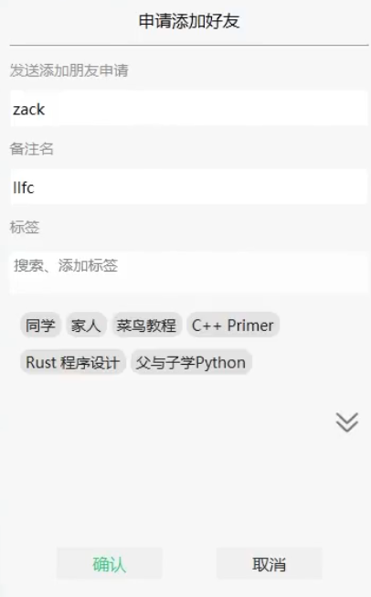
确认时通过TCPMgr发送请求加好友的数据包, 然后在TCP中处理回包即可
### 同意添加好友页面
因为需要同意申请, 因此有一个map存储uid和ui
qss设置一下就可以变得像微信一样
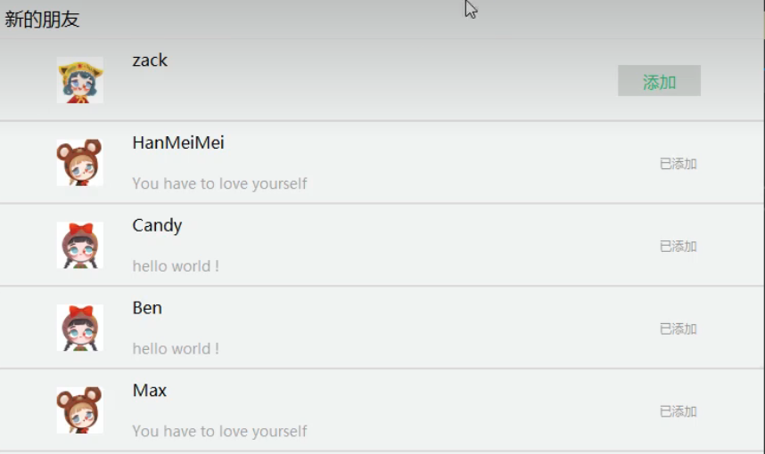
点击添加后, 需要弹出一个确认添加好友的框
### 确认添加好友
widget要自己重写paintEvent, 而dialog不用
在登录时要将好友请求从mysql中读出来, 用登录的id查from的id, 这样就能够查到所有发送好友请求到自己身上的用户的信息
查到后发回给客户端, TCP将这些用户信息存储到UserMgr中, 然后在页面中显示即可
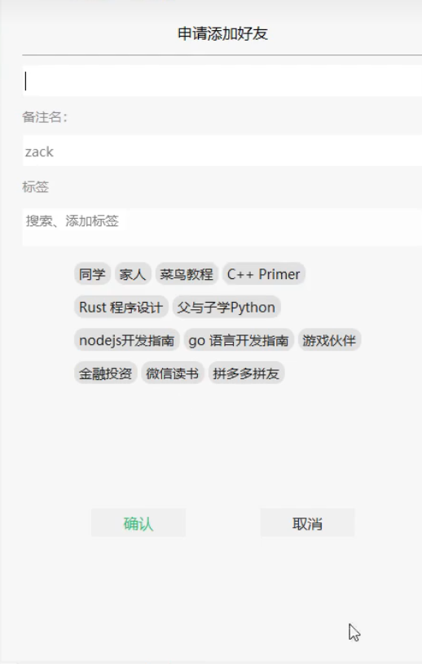
### 点击确认后的添加好友逻辑

我同意后, 发给服务器, 服务器告诉对方已经加为好友, 加到map
对方同意后, 发给服务器, 服务器告诉我已经加为好友, 加到map

同意好友后要发送一个信号将item的按钮取消并且重新排序, 这样才好看, 要确定是哪个item, 需要uid跟item进行绑定
### 搜素到好友跳转到聊天页面
如果搜到自己可以跳转到与自己聊天 ()
搜到好友则跳转到好友聊天界面, 由searchList发出请求, TCP处理回包, ChatDialog跳转页面

登录的时候要把好友的信息都放到UserMgr中, 用一个链表和一个map管理 (链表保证有序)
### 滑动时加载
UserMgr中添加map管理好友, 在滑动到底部时增加item, 同时在UserMgr中记录已经加载的数量
### 点击好友item跳转到聊天页面
设置一个cur_chat_uid, 点击时替换


[[explict]]关键字禁止隐式转换, 禁止隐式调用拷贝函数

qss设置滑动条字体页面等

用stackWidget实现页面内的内容切换
### ChatPage
将widget单独拿出来作为一个类, 可以很方便的在构造函数中设置一些初始的设置 

<font color="#ff0000">QWidget默认是paintEvent是空, 如果有自定义的控件继承自QWidget,可以进行重写将Style和Paint绑定起来</font>
```c
void ChatPage::paintEvent(QPaintEvent *event)
{
    QStyleOption opt;
    opt.initFrom(this);
    QPainter p(this);
    style()->drawPrimitive(QStyle::PE_Widget, &opt, &p, this);
}
```

### ChatView
widget, 垂直布局, ScrowView, 再嵌套widget填充满ScrowView, 再嵌套Layout填充widget, Layout再放widget, 这个widget就可以放聊天气泡了

`ChatView` 类通过 `QScrollArea` 实现滚动容器，内部嵌套一个带垂直布局的 `QWidget` 作为消息项的容器。构造函数中构建主布局和滚动区域，将滚动条的垂直策略设为 `Qt::ScrollBarAlwaysOff` 初始隐藏，通过 ​**​事件过滤器​**​ 监听鼠标进入/离开事件：鼠标进入滚动区域时，若内容超出可视范围（`verticalScrollBar()->maximum() != 0`）则显示滚动条；离开时强制隐藏，实现 ​**​悬停显隐交互​**​。滚动条的布局被强制修改为右侧对齐，覆盖默认位置。

`appendChatItem` 方法将消息项插入到垂直布局的倒数第二位（占位弹簧之前），触发 `rangeChanged` 信号，在槽函数 `onVScrollBarMoved` 中检测 `isAppended` 标记，若为 `true` 则立刻滚动到底部，并通过 `QTimer::singleShot` 在 500ms 后重置标记，避免快速追加时重复滚动。但该机制存在 ​**​竞态风险​**​：若 500ms 内连续追加多次，可能只有最后一次触发滚动。

`removeAllItem` 遍历布局项并直接 `delete` 控件，存在 ​**​野指针风险​**​，应改用 `deleteLater` 安全释放。`prependChatItem` 和 `insertChatItem` 未实现，留空导致功能缺失。`paintEvent` 重写仅为继承样式，未添加自定义绘制逻辑。整个类的滚动条样式通过 `initStyleSheet` 预留接口，但实际代码为空，需后续通过 QSS 注入样式规则。

每个 `ChatView` 实例通过 `m_pScrollArea` 管理独立的消息项集合，滚动条和布局状态互不干扰，因此 ​**​无需单例模式​**​。事件过滤器中传递 `this` 指针，确保不同实例的事件逻辑隔离。`isAppended` 作为成员变量，仅作用于当前实例的滚动状态，不同 `ChatView` 的自动滚动互不影响。`LogicSystem` 若存在，需通过回调函数操作具体的 `ChatView` 实例，类似 HTTP 连接中每个请求独立处理的方式，避免全局状态污染。
### 聊天气泡绘制
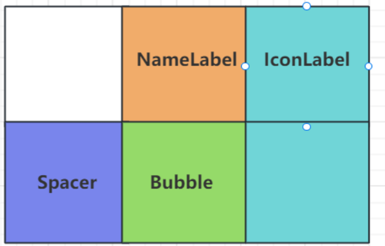
总体来说是这样的
主要是Bubble的绘制, 用paintEvent重新绘制气泡, 然后将文本放到气泡上
而气泡有很多种, 图片, 视频等, 因此创建一个bubble基类

先从编辑框中读取文本, 看看是什么信息,

```c
QTextEdit（富文本，含图片对象）       
            ↓
  toPlainText() 拿到纯文本
            ↓
  遍历每个字符
      ↓            ↘
普通字符        特殊字符 QChar::ObjectReplacementCharacter
      ↓                    ↓
 累加为 text             查找 mMsgList 中图片
      ↓                    ↓
 到图片前断开       将图片 msg 添加到结果中
            ↓
   插入文字 MsgInfo
            ↓
      返回结构化 QVector<MsgInfo>
```
然后分类, 进行不同气泡的绘制, 气泡内部就可以进行文字或者图片的绘制, 而类似微信的绿色气泡就交给基类BubbleFrame进行绘制
再将Bubble放到ChatItemBase, 再将ChatItemBase放到list中即可
添加新的widget后, qt自动调用update, 触发paintEvent
#### 拖入图片
重写拖入事件, 然后插入图片, 进行放缩即可, 如果要插入链接也可以识别链接
## 将运行需要的静态文件拷贝到运行目录中

```c
CONFIG(debug, debug|release) {
        #debug
    message("debug mode")
    #指定要拷贝的文件目录为工程目录下release目录下的所有dll、lib文件，例如工程目录在D:\QT\Test
    #PWD就为D:/QT/Test，DllFile = D:/QT/Test/release/*.dll
    TargetConfig = $${PWD}/config.ini
    #将输入目录中的"/"替换为"\"
    TargetConfig = $$replace(TargetConfig, /, \\)
    #将输出目录中的"/"替换为"\"
    OutputDir =  $${OUT_PWD}/$${DESTDIR}
    OutputDir = $$replace(OutputDir, /, \\)
    //执行copy命令
    QMAKE_POST_LINK += copy /Y \"$$TargetConfig\" \"$$OutputDir\" &

    # 首先，定义static文件夹的路径
    StaticDir = $${PWD}/static
    # 将路径中的"/"替换为"\"
    StaticDir = $$replace(StaticDir, /, \\)
    #message($${StaticDir})
    # 使用xcopy命令拷贝文件夹，/E表示拷贝子目录及其内容，包括空目录。/I表示如果目标不存在则创建目录。/Y表示覆盖现有文件而不提示。
     QMAKE_POST_LINK += xcopy /Y /E /I \"$$StaticDir\" \"$$OutputDir\\static\\\"
}else{
      #release
    message("release mode")
    #指定要拷贝的文件目录为工程目录下release目录下的所有dll、lib文件，例如工程目录在D:\QT\Test
    #PWD就为D:/QT/Test，DllFile = D:/QT/Test/release/*.dll
    TargetConfig = $${PWD}/config.ini
    #将输入目录中的"/"替换为"\"
    TargetConfig = $$replace(TargetConfig, /, \\)
    #将输出目录中的"/"替换为"\"
    OutputDir =  $${OUT_PWD}/$${DESTDIR}
    OutputDir = $$replace(OutputDir, /, \\)
    //执行copy命令
    QMAKE_POST_LINK += copy /Y \"$$TargetConfig\" \"$$OutputDir\"

    # 首先，定义static文件夹的路径
    StaticDir = $${PWD}/static
    # 将路径中的"/"替换为"\"
    StaticDir = $$replace(StaticDir, /, \\)
    #message($${StaticDir})
    # 使用xcopy命令拷贝文件夹，/E表示拷贝子目录及其内容，包括空目录。/I表示如果目标不存在则创建目录。/Y表示覆盖现有文件而不提示。
     QMAKE_POST_LINK += xcopy /Y /E /I \"$$StaticDir\" \"$$OutputDir\\static\\\"
}

win32-msvc*:QMAKE_CXXFLAGS += /wd"4819" /utf-8
```
utf-8支持各平台进行编译
## 侧边栏
将label提升为StateLabel, StateLabel的几个状态中可以加上一个红点状态
将侧边栏按钮都放到一个链表中
点击一个按钮后, 发送切换页面信号, 切换页面信号的槽函数会将其他按钮的状态都清除, 并且转换页面

textChanged可以作为信号触发搜索用户列表

## 添加资源文件
添加资源文件 ,add new, qrc
右键qrc文件, 添加现有文件, 然后放文件就行
Qlabel的pixmap增加图片
## 拖动布局
为了拖布局的时候好拖, 可以适当增加margin
垂直布局里嵌套水平布局, 如果有什么东西很大, 可以用Spacer挤一挤
## QT自动管理内存
用 Qt 的父子对象体系自动管理内存：
- 通过指定父对象（this）实现自动回收, 比如_login_dlg = new LoginDialog (this);
- setCentralWidget () 自动删除旧部件, 自动管理页面, 一次只显示一个页面
- show () 并非立即显示，而是将显示请求加入事件队列
## UI与Connect
connect (发送者, 信号, 接收者, 槽函数)
ui是用来读取当前界面所绘制前端的那些控件的, 同时也是我们操作控件的接口
## edit设置为密码模式
```
ui->lineEdit_Passwd->setEchoMode(QLineEdit::Password);
```
## 槽函数
右键转到槽 , click事件可以自动生成槽函数
## 添加网络库
在pro中加上QT       += core gui network, 添加网络库
## 发送请求的模板
发送http的post请求, 发送请求要用到请求的url，请求的数据 (json或者protobuf序列化)，以及请求的id，以及哪个模块发出的请求mod
## 定义各种类型
通过enum定义ErrorCode或者其他的什么枚举类型
## Style, qss
新建style文件夹, 再新建一个qss文件, 然后再qrc文件新加现有文件即可

用QFile读取, 读取成功后readAll转成QString
QLatin1String将QByte转成QString
然后QApplication设置即可

通过qss可以给字体的不同状态不同颜色显示
每次设置的时候需要刷新, 这样的功能同时也可以直接修改label的颜色来完成
# MVC简单制作待办清单
View绑定Model, setModel
然后
<font color="#ff0000">view会问model</font>, 有几行rowCount, 有几列columnCount, 表头写什么headerData, 哪些格子有行为权限flags

model是数据跟表格的翻译器
view只会跟model要数据然后显示
controller则是负责调度, 检测事件, 调用model, 监听model变化

1. `QTableView` 问 model 有几行几列
    
2. 然后一个格子一个格子地问内容
    
3. model 返回文本/勾选状态/对齐方式
    
4. view 负责画出来
    

所以：

**View 只管问，Model 只管答。**

我对 MVC 的理解是，把程序分成 Model、View、Controller 三部分。Model 负责数据和业务状态，View 负责界面展示，Controller 负责接收用户操作并协调 Model 和 View。这样做的好处是把数据、界面、交互解耦，后期更容易维护和扩展。

拿我做过的一个 Qt 日志清单功能来说，`DiaryTask` 和 `DiaryTableModel` 属于 Model，`QTableView` 属于 View，`DiaryDialog` 负责按钮点击、增删改查和保存 JSON，可以看作 Controller。界面本身不直接保存数据，而是通过 model 提供数据给 view；当 model 变化时，再通知 view 刷新。这样结构会比较清晰。
# 回忆
## 登录
1. 客户端HTTP发送登录请求, GateSever查到了合适的ChatSever, 发回给客户端,然后客户端根据那个地址去连接chatSever和resSever, 建立好连接后, 正式发送一个TCP登录请求, 随后从ChatSever那里得到该用户的所有信息, 以及朋友和朋友请求

2. 换成ChatDialog, 然后加载聊天列表, ChatSever返回会话信息, 然后将会话加到左侧, 加载好左边的会话后, 根据目前所处的会话, 加载该会话的所有聊天信息, 由TCPmgr处理从ChatServer得到的消息, 发个信号让聊天页面刷新, 刷新就是查找thread, 然后让list聚焦于那个会话, 再加载那个会话中的消息
## 获取会话
切换成chatdialog的时候从tcpmgr获取该用户的所有会话thread(从<font color="#ff0000">loadChatList</font>开始), 然后由chatdialog自己处理
## 加上群聊
需要处理的
 ChatDialog::slot_load_chat_thread
 ChatPage:: SetChatData (

ChatMsgType::TEXT
## 改成model
slot_auth_rsp

# windows启动redis
修改conf, 端口号和启动密码
启动服务器
```
.\redis-server.exe .\redis.windows.conf
```


启动客户端.\redis-cli. exe -p 6380 密码
# nodejs给邮箱发送验证码
config. json
读取时用json读取即可

因为transport. SendMail是异步函数 所以用new Promis将异步转成同步, 阻塞等待函数的运行, 这样函数外部就可以用await或then catch的方式处理了

用uuidv4随机生成验证码, 并且通过redis暂存验证码, 给验证码设置过期时间RedisCli. expire (key, exptime);

再proto文件的服务端定义了GetVarifyCode方法,
那么当客户端调用这个 RPC 方法时，gRPC 框架就会：

- 自动把客户端发来的 `GetVarifyReq` 塞进 `call.request`
    
- 把返回给客户端的 `GetVarifyRsp` 通过 `callback(null, response)` 发回


服务端初始化时，通过 `grpc.Server()` 创建一个服务监听对象，称为<font color="#ff0000"> gRPCServer，内部持有 socket</font>。调用 `bindAsync()` 方法时，gRPC 从系统的事件循环中获取一个 socket，绑定地址（如 `0.0.0.0:50051`），准备监听连接请求。

**客户端连接后，gRPC 会自动为其建立连接和数据通道**，并读取请求数据（类似于 C++ 中的 `async_read`），这些请求数据最终被封装进一个 `call` 对象中，它包含了解析后的请求信息，比如这里的 `call.request.email`，就相当于 HTTP 中 `request.body["email"]`。

接收到数据后，gRPC 内部会<font color="#ff0000">根据客户端请求的服务名和方法名</font>（比如 `VarifyService.GetVarifyCode`）去服务注册表中查找对应的处理函数。这个服务注册表就是通过 `server.addService()` 注册进去的 map：键是 `GetVarifyCode`，值是实现的处理函数（如 `GetVarifyCode(call, callback)`）。这个注册过程等价于 `LogicSystem::RegPost(...)`。

于是，gRPC 调用绑定的 `GetVarifyCode` 函数，传入请求内容 `call` 和用于响应客户端的 `callback`（相当于在 C++ 中通过 `connection->_response.body()` 写入响应数据）。在函数里就可以做所有逻辑处理：查 redis、发邮件、拼 JSON，然后再通过 `callback(null, response)` 发送响应。

而且由于 JavaScript 本身是事件驱动、单线程，Node. js 会在事件队列中处理每个连接、每次请求的回调，不需要像 C++ 手动写 `shared_from_this()` 保活逻辑。每次新请求进来，就重新调的处理函数，call 和 callback 是全新的对象，因此不会存在“数据重叠”问题。

package. json加上
  "scripts": {
    "serve": "node server. js"
  },
  这样直接输入npm run serve即可启动rgpc服务端  
# mysql配置
id设自增
刚开始运行的时候运行id = id + 1会报错, 因为id一开始是没有值的, 所以要用如下代码

```c

 -- 检查 user_id 表是否为空
 IF (SELECT COUNT(*) FROM `user_id`) = 0 THEN     
   -- 如果 user_id 表为空，初始化 id 为 1     I
   NSERT INTO `user_id` (id) VALUES (1); 
 ELSE     
   -- email也不存在，更新user_id表     
   UPDATE `user_id` SET `id` = `id` + 1; 
 END IF;
```

CREATE USER 'root'@'%' IDENTIFIED BY 'your_password_here';
GRANT ALL PRIVILEGES ON *.* TO 'root'@'%' WITH GRANT OPTION;
FLUSH PRIVILEGES;

[[事务]]就是一组操作，要么全部成功，要么全部失败。
在事务中如果用户已存在或者邮箱已存在, 那么result返回0
如果mysql执行错误, 那么result返回1
如果全都成功, 返回1
# 要配置的
boost, json, grpc, cmake, nasm, vcpkg, redis库, myqsl connector c++
[[mysql connector的dll要同步生成到运行目录]]

VS 属性管理器, Debug64添加新项目属性表

# 其他
Proactor网络模式
tlv方式(消息头 (消息id + 消息长度))封装消息包防止粘包
心跳模式, 各种各样的中断, 僵尸连接, 造成性能损耗, 保证连接持续可用

多个线程使用一个连接是不安全的, 所以为每个线程分配独立连接, 而连接数不能随着线程增加无限增加, 因此创建连接池, 每个线程想要操作mysql的时候从连接池取出连接进行数据访问

压力测试, 客户端初始多个线程定时间隔连接
一定连接数下收发效率稳定性
pingong协议

生产者消费者模式
Acto模式, 逻辑解耦
单例模式
RALL思想 (defer回收)
代理模式 (DAO)
MVC模式
线程分离, 网络现场, 数据处理线程
心跳服务
数据序列化压缩发送 (Protobuf, Json)
队列解耦合, 服务器采用发送队列保证异步顺序, 接收队列缓存收到数据, 通过逻辑队列处理数据
分布式设计, 多服务通过grpc通信, 支持断线重连
c++11现代化技术, 伪闭包(保证生命周期), 线程池, future

C++11风格, 线程池通过单例封装, 内部初
始化N个线程, 包含任务队列,
future特性, 允许外部等待任务执行完成
[[enable_shared_from_this]]
[[atomic]]
[[condition_variable和mutex]]
[[grpc]]
[[boost]]
IPC_PRIVATE, 用它来创建的对象key属性值为0, 和无名管道类似

bind,
网络字节序 (大端模式), 高位存低地址
[[../000-计算机大类/Linux高性能服务器编程/timeval|timeval]]

[[inet_ntop]]
[[../000-计算机大类/TCP_IP网络编程/send|send]]
[[../000-计算机大类/TCP_IP网络编程/recv|recv]]

服务端客户端都要发送和接收信息, 那么就会把这两个工作分给两个进程, 而服务端要同时应对多个客户端, 因此需要在 [[../000-计算机大类/TCP_IP网络编程/fork|fork]] 下面再进行接受和发送

QT, 和java中的GUI编程还挺像
qmake-project生成工程文件
然后 [[makefile]] 运行就会生成可执行文件


```
/******************************************************************************
 * @file       %{CurrentDocument:FileName}
 * @brief      XXXX Function
 *
 * @author     Tao_z
 * @date       %{CurrentDate:yyyy\/MM\/dd}
 * @history    
*****************************************************************************/


```


建立窗口的时候，指定this，就可以与父进程绑定从而自动释放内存

刷新qss
```c
std::function<void(QWidget*)> repolish = [](QWidget* w){
    // 卸掉
    w->style()->unpolish(w);
    // 刷新
    w->style()->polish(w);
};
```
参数设置为QWidget指针就可以获取到所有的组件

CRTP

[[shared_ptr]]
[[奇异递归]]
[[QT的Http请求]]
序列化Serialize --> 字节流ByteArray --> 服务端收到 (组包) --> 字符串 (ByteArray) --> 转换成类对象 (反序列化)

服务器尽量不要主动关客户端， 可能造成timewait

如果两个头文件有互相包含，那么可以先声明， 然后再在cpp里面进行include

类的成员是引用类型，要在初始化列表进行初始化

[[config.ini]]
[[io_context]]
两种池的实现方式，一种全局单例 [[AsioIOContextPool]]，另一种普通队列

[[lock_guard和unique_lock的区别]]
[[shared_ptr和unique_ptr的区别]]

封装hredis，并且用到了线程池的概念，和grpc用的池一样
[[RedisMgr]]

node. js也要封装redis，不过node. js是“单线程的”，所以也没有池的概念

封装mysql链接的池，分了
池，DAO，和service（也就是Mgr）
那么，[[MysqlPool]]，[[MysqlDao]]，
MysqlMgr是实际操作数据库的，所以要用单例来实现，作为全局都能操作的对象

同时引入RAII的思想，也就是利用类的生命周期，实现类似go语言中defer的概念，[[Defer]]
## grpc
[[grpc]] 微软默认编译是mdd编译

接口和通信

注意编写 [[message.proto]] 的格式